# Let's Chat — Architecture & Workflow Document

> A comprehensive technical deep-dive into the full-stack architecture of the **Let's Chat** real-time messaging platform.

---

## 1. High-Level System Overview

```mermaid
graph TB
    subgraph Monorepo["Turborepo Monorepo"]
        subgraph Frontend["apps/web — Next.js 16"]
            direction TB
            Pages["App Router Pages"]
            Components["UI Components"]
            Stores["Zustand Stores"]
            Hooks["Custom Hooks"]
            Providers["Context Providers"]
            Services["Service Layer"]
        end

        subgraph Backend["apps/api — Express.js"]
            direction TB
            Server["HTTP + Socket.IO Server"]
            Middlewares["Middleware Pipeline"]
            Controllers["Controllers"]
            BServices["Business Services"]
            Repositories["Data Repositories"]
            Models["Mongoose Models"]
            Database["MongoDB"]
        end

        subgraph SharedPkgs["packages/"]
            ESLintConfig["@repo/eslint-config"]
            TSConfig["@repo/typescript-config"]
            UIKit["@repo/ui"]
        end

        Frontend <-->|"REST API (Axios)\nWebSocket (Socket.IO)"| Backend
        Frontend -.->|shared configs| SharedPkgs
        Backend -.->|shared configs| SharedPkgs
    end
```

### Technology Stack Summary

| Layer | Technology | Version | Purpose |
|-------|-----------|---------|---------|
| **Monorepo** | Turborepo | 2.7.2 | Build orchestration, caching, task dependency graph |
| **Frontend** | Next.js (App Router) | 16.2.0 | SSR/CSR hybrid React framework |
| **UI Library** | React | 19.2.0 | Component-based UI rendering |
| **Styling** | TailwindCSS | 3.4.17 | Utility-first CSS framework |
| **State Mgmt** | Zustand | 5.0.2 | Lightweight global state with persistence |
| **Data Fetching** | TanStack React Query | 5.62.7 | Server-state cache + async data management |
| **HTTP Client** | Axios | 1.7.9 | REST API calls with interceptors |
| **Real-time** | Socket.IO Client | 4.8.1 | WebSocket-based bidirectional communication |
| **Animations** | Framer Motion | 11.15.0 | Declarative motion & page transitions |
| **Forms** | React Hook Form + Zod | 7.54.1 / 3.24.1 | Form state management + schema validation |
| **Backend** | Express.js | 4.21.2 | REST API server framework |
| **Real-time Server** | Socket.IO | 4.8.1 | WebSocket server with room management |
| **Database** | MongoDB (Mongoose) | 8.9.2 | Document-based persistence |
| **Auth** | JSON Web Tokens | 9.0.2 | Stateless JWT authentication |
| **Logging** | Pino | 9.5.0 | High-performance structured logging |
| **Security** | Helmet + CORS + Rate Limit | — | HTTP header hardening, CORS policy, request throttling |
| **Language** | TypeScript | 5.9.2 | End-to-end type safety |

---

## 2. Monorepo Architecture

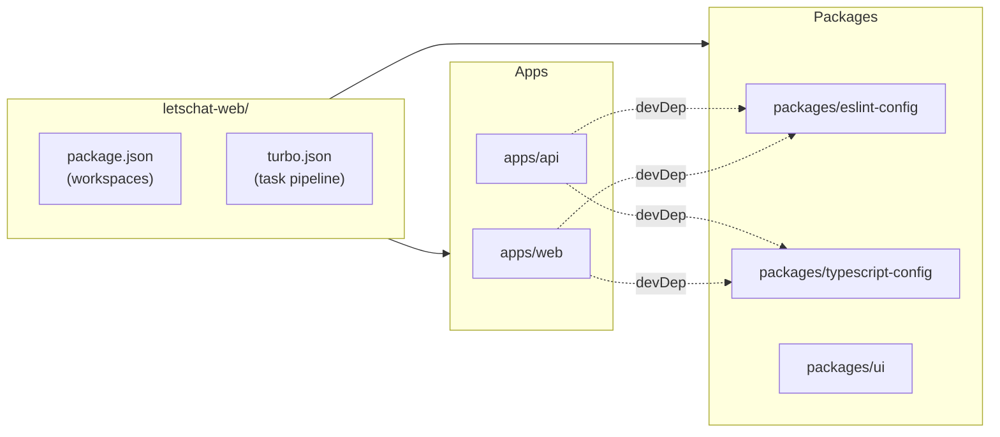

### Workspace Layout

```
letschat-web/
├── apps/
│   ├── web/              # Next.js 16 frontend (port 3000)
│   └── api/              # Express + Socket.IO backend (port 5000)
├── packages/
│   ├── eslint-config/    # Shared ESLint rules (@repo/eslint-config)
│   ├── typescript-config/ # Shared tsconfig bases (@repo/typescript-config)
│   └── ui/               # Shared UI component library (@repo/ui)
├── turbo.json            # Turborepo pipeline configuration
└── package.json          # Root workspace configuration (npm workspaces)
```

### Turborepo Task Pipeline

| Task | Dependencies | Caching | Outputs |
|------|-------------|---------|---------|
| `build` | `^build` (topological) | ✅ Cached | `.next/**` (excluding cache/dev) |
| `dev` | None | ❌ No cache | Persistent process |
| `lint` | `^lint` | ✅ Cached | — |
| `check-types` | `^check-types` | ✅ Cached | — |

---

## 3. Frontend Architecture (apps/web)

### 3.1 Directory Structure

```
apps/web/src/
├── app/                    # Next.js App Router (pages & layouts)
│   ├── layout.tsx          # Root layout (providers tree)
│   ├── page.tsx            # Splash/Landing screen
│   ├── sign-in/            # Authentication — Sign In
│   ├── sign-up/            # Authentication — Sign Up
│   ├── forgot-password/    # Password recovery
│   ├── reset-password/     # Password reset
│   └── (main)/             # Protected route group
│       ├── layout.tsx      # Main app shell (Sidebar + Call overlay)
│       ├── chat/           # Chat messaging page
│       ├── status/         # Status/Stories page
│       ├── channels/       # Channels/Broadcasts page
│       ├── communities/    # Communities & group chats page
│       └── calls/          # Call history page
├── components/             # Reusable UI components
│   ├── auth/               # Auth forms (SignIn, SignUp, Forgot/Reset)
│   ├── sidebar/            # Navigation sidebar & settings drawer
│   ├── chat-list/          # Chat room list with filters
│   ├── chat-window/        # Message feed, input, bubbles
│   ├── details-panel/      # Contact/group details side panel
│   ├── status/             # Status stories viewer & creator
│   ├── channels/           # Channel feed & viewer
│   ├── communities/        # Community groups & messaging
│   ├── calls/              # Call history & active call screen
│   └── ui/                 # Primitives (buttons, inputs, modals)
├── store/                  # Zustand state stores
│   ├── auth-store.ts       # Authentication state
│   ├── chat-store.ts       # Chat rooms & messages
│   ├── status-store.ts     # Status/Stories state
│   ├── channels-store.ts   # Channels & subscriptions
│   ├── communities-store.ts # Communities & group messaging
│   ├── call-store.ts       # Active call state
│   └── ui-store.ts         # UI toggles (drawers, modals)
├── hooks/                  # Custom React hooks
│   ├── use-chat-window.ts  # Chat messaging logic
│   ├── use-chat-list.ts    # Chat filtering & search
│   ├── use-socket.ts       # Socket.IO connection hook
│   ├── use-status.ts       # Status interaction logic
│   ├── use-channels.ts     # Channel following/reactions
│   ├── use-communities.ts  # Community group selection
│   ├── use-call-screen.ts  # Call timer & controls
│   ├── use-settings.ts     # Settings form management
│   ├── use-sidebar.ts      # Sidebar navigation state
│   ├── use-media-modal.ts  # Media gallery modal
│   └── use-splash-loading.ts # Splash screen progress
├── providers/              # React Context providers
│   ├── theme-provider.tsx  # Dark/Light/System theme (next-themes)
│   ├── query-provider.tsx  # TanStack Query client
│   ├── socket-provider.tsx # Socket.IO connection context
│   └── toast-provider.tsx  # Sonner toast notifications
├── services/               # API abstraction layer
│   ├── status-service.ts   # Status CRUD operations
│   ├── communities-service.ts # Community data operations
│   └── channels-service.ts # Channel data operations
├── lib/                    # Core utilities
│   └── axios.ts            # Axios instance with interceptors
├── types/                  # TypeScript type definitions
│   ├── chat.ts             # Message, ChatRoom, Attachment
│   ├── status.ts           # StatusStory, UserStatus
│   ├── channels.ts         # Channel, ChannelStory
│   ├── communities.ts      # Community, CommunityGroup, GroupMessage
│   ├── calls.ts            # CallRecord, CallHistoryItem
│   └── settings.ts         # Settings types
├── validation/             # Zod schemas
│   └── index.ts            # loginSchema, registerSchema, messageSchema
├── constants/              # Static mock data
│   └── mock-data.ts        # Mock chat rooms & messages
├── data/                   # Initial seed data
│   ├── status-data.ts      # Initial status stories
│   ├── channels-data.ts    # Initial channel feeds
│   ├── communities-data.ts # Initial communities & messages
│   └── settings-data.ts    # Default settings values
├── styles/                 # Global CSS
│   └── globals.css         # TailwindCSS directives + custom styles
└── utils/                  # Helper functions
```

### 3.2 Provider Architecture (Composition Root)

The root [layout.tsx](file:///d:/Personal Projects/letschat-web/apps/web/src/app/layout.tsx) establishes a provider tree that wraps the entire application:

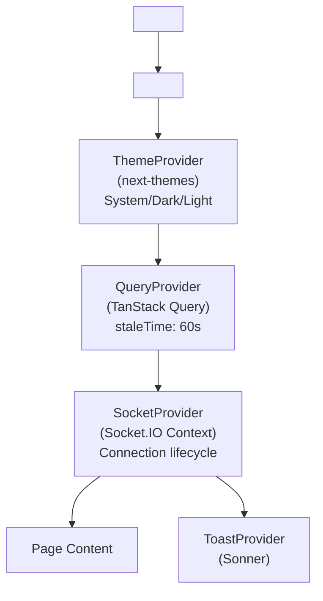

> [!IMPORTANT]
> The `SocketProvider` currently has its connection logic **commented out** for static/demo mode. When connecting to the live backend, it creates a Socket.IO client pointing to `NEXT_PUBLIC_API_URL` with auto-reconnect (5 attempts, 1s delay).

### 3.3 State Management Architecture

The application uses **Zustand** for client-side state management with a store-per-domain pattern. Three stores use the `persist` middleware for localStorage durability.

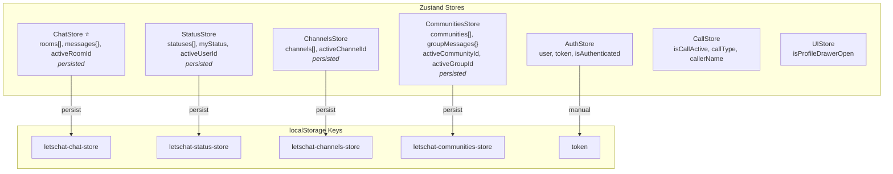

#### Store Details

| Store | File | Persisted | Key Actions |
|-------|------|-----------|-------------|
| **AuthStore** | [auth-store.ts](file:///d:/Personal Projects/letschat-web/apps/web/src/store/auth-store.ts) | Token only (manual) | `setAuth`, `logout`, `updateUser` |
| **ChatStore** | [chat-store.ts](file:///d:/Personal Projects/letschat-web/apps/web/src/store/chat-store.ts) | ✅ Full state | `sendMessage`, `sendVoiceNote`, `sendAttachment`, `receiveMessage`, `clearUnread` |
| **StatusStore** | [status-store.ts](file:///d:/Personal Projects/letschat-web/apps/web/src/store/status-store.ts) | ✅ Full state | `setActiveUserId`, `markRead`, `publishStatus` |
| **ChannelsStore** | [channels-store.ts](file:///d:/Personal Projects/letschat-web/apps/web/src/store/channels-store.ts) | ✅ Full state | `toggleFollow`, `reactToStory` |
| **CommunitiesStore** | [communities-store.ts](file:///d:/Personal Projects/letschat-web/apps/web/src/store/communities-store.ts) | ✅ Full state | `selectGroup`, `sendMessageToGroup` |
| **CallStore** | [call-store.ts](file:///d:/Personal Projects/letschat-web/apps/web/src/store/call-store.ts) | ❌ | `startCall`, `endCall` |
| **UIStore** | [ui-store.ts](file:///d:/Personal Projects/letschat-web/apps/web/src/store/ui-store.ts) | ❌ | `openProfileDrawer`, `closeProfileDrawer` |

### 3.4 Component Architecture

#### Main App Shell Layout

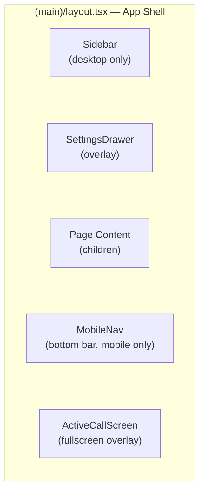

#### Chat Page — Multi-Pane Layout

The [ChatPage](file:///d:/Personal Projects/letschat-web/apps/web/src/app/(main)/chat/page.tsx) implements a responsive multi-pane design:

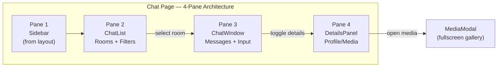

**Responsive Behavior:**

| Viewport | Pane 1 (Sidebar) | Pane 2 (Chat List) | Pane 3 (Chat Window) | Pane 4 (Details) |
|----------|-----------------|-------------------|---------------------|------------------|
| **Desktop** | Visible (left rail) | Visible | Visible | Toggle overlay |
| **Mobile** | Hidden (bottom nav instead) | Visible when no room selected | Visible when room selected | Toggle overlay |

#### Chat Window Component Tree

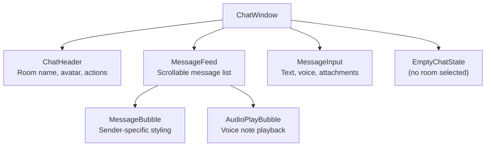

#### Component Inventory

| Domain | Components | Key Files |
|--------|-----------|-----------|
| **Auth** | `SignInForm`, `SignUpForm`, `ForgotPasswordForm`, `ResetPasswordForm`, `BrandingPanel`, `SocialLogin` | [auth/](file:///d:/Personal Projects/letschat-web/apps/web/src/components/auth) |
| **Sidebar** | `Sidebar`, `SidebarHeader`, `SidebarNavItem`, `SidebarFooter`, `SettingsDrawer`, `MobileNav` | [sidebar/](file:///d:/Personal Projects/letschat-web/apps/web/src/components/sidebar) |
| **Chat List** | `ChatList` (with filter tabs, search, room cards) | [chat-list/](file:///d:/Personal Projects/letschat-web/apps/web/src/components/chat-list) |
| **Chat Window** | `ChatWindow`, `ChatHeader`, `MessageFeed`, `MessageBubble`, `MessageInput`, `AudioPlayBubble`, `EmptyChatState` | [chat-window/](file:///d:/Personal Projects/letschat-web/apps/web/src/components/chat-window) |
| **Details Panel** | `DetailsPanel`, `DetailsHeader`, `DetailsProfileCard`, `DetailsAbout`, `DetailsSettings`, `DetailsSharedAssets`, `MediaModal` | [details-panel/](file:///d:/Personal Projects/letschat-web/apps/web/src/components/details-panel) |
| **Status** | Status viewer and creator components | [status/](file:///d:/Personal Projects/letschat-web/apps/web/src/components/status) |
| **Channels** | Channel feed and story viewer | [channels/](file:///d:/Personal Projects/letschat-web/apps/web/src/components/channels) |
| **Communities** | Community list, group chat, messaging | [communities/](file:///d:/Personal Projects/letschat-web/apps/web/src/components/communities) |
| **Calls** | Call history, active call screen | [calls/](file:///d:/Personal Projects/letschat-web/apps/web/src/components/calls) |
| **Global** | `BrandLogo`, `SplashBackground`, `ThemeToggle`, `ProgressBar`, `EncryptionNotice` | [components/](file:///d:/Personal Projects/letschat-web/apps/web/src/components) |

### 3.5 Custom Hooks Architecture

Hooks encapsulate business logic and decouple it from the UI layer:

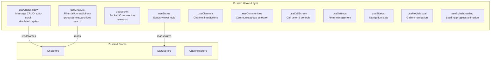

#### Key Hook: [useChatWindow](file:///d:/Personal Projects/letschat-web/apps/web/src/hooks/use-chat-window.ts)

| Responsibility | Detail |
|---------------|--------|
| Message reading | Selects messages from ChatStore by `activeRoomId` |
| Message sending | Dispatches `sendMessage`, `sendVoiceNote`, `sendAttachment` to store |
| Auto-scroll | `useEffect` scrolls to bottom via `messagesEndRef` on messages/room change |
| Simulated replies | After sending to "olivia" room, triggers a mock reply after 1.5s delay |
| Input state | Manages `inputText` + `setInputText` locally |

#### Key Hook: [useChatList](file:///d:/Personal Projects/letschat-web/apps/web/src/hooks/use-chat-list.ts)

| Filter | Criteria |
|--------|---------|
| `all` | All non-archived rooms |
| `unread` | `unreadCount > 0` |
| `direct` | `type === "direct"` |
| `groups` | `type === "group"` |
| `mentions` | `hasMention === true` |
| `pinned` | `isPinned === true` |
| `archive` | `isArchived === true` |

Search overlays on top of any filter, matching room `name` or `lastMessage`.

### 3.6 Data Flow Architecture

#### REST API Communication

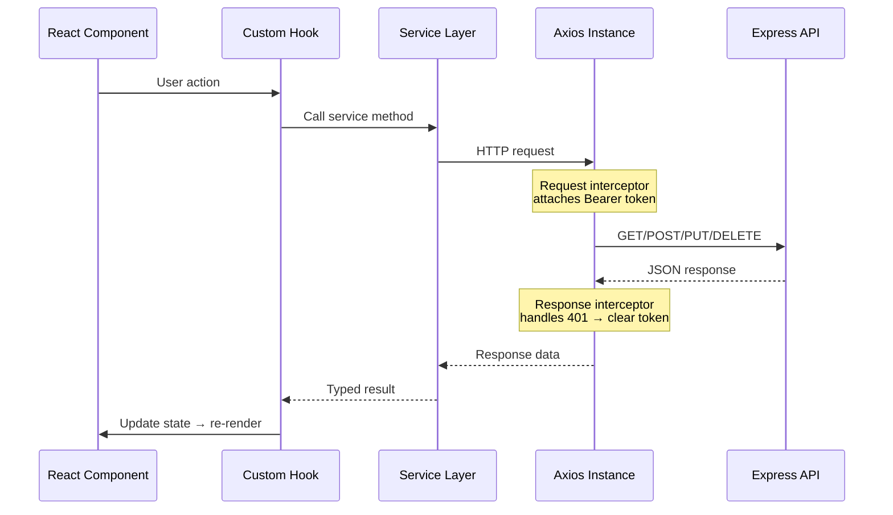

The [Axios instance](file:///d:/Personal Projects/letschat-web/apps/web/src/lib/axios.ts) provides:
- **Base URL**: `NEXT_PUBLIC_API_URL` or `http://localhost:5000/api`
- **Request interceptor**: Auto-attaches `Authorization: Bearer <token>` from localStorage
- **Response interceptor**: On 401, clears the stored token (auto-logout)

#### Real-time Communication (Socket.IO)

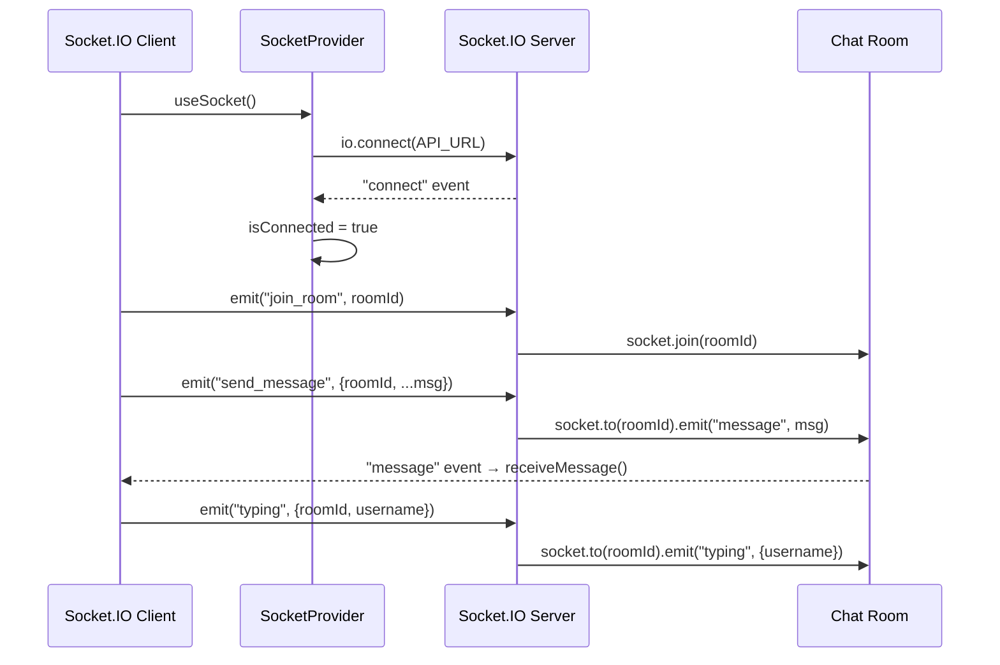

### 3.7 Type System

All types are centralized in [types/](file:///d:/Personal Projects/letschat-web/apps/web/src/types) and shared across stores, hooks, services, and components:

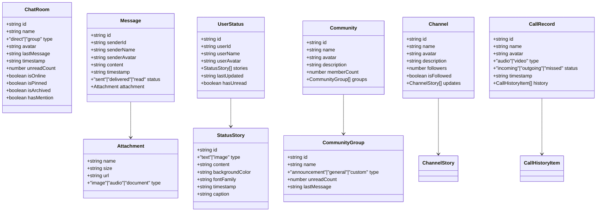

### 3.8 Validation Layer

[validation/index.ts](file:///d:/Personal Projects/letschat-web/apps/web/src/validation/index.ts) defines Zod schemas used by React Hook Form via `@hookform/resolvers`:

| Schema | Fields | Rules |
|--------|--------|-------|
| `loginSchema` | `email`, `password` | Valid email; password ≥ 6 chars |
| `registerSchema` | `username`, `email`, `password` | Username 3-20 chars, alphanumeric + underscore; valid email; password ≥ 6 chars |
| `messageSchema` | `content` | Non-empty; max 1000 chars |

---

## 4. Backend Architecture (apps/api)

### 4.1 Directory Structure

```
apps/api/src/
├── server.ts              # Entry point — HTTP server + Socket.IO bootstrap
├── app.ts                 # Express app — middleware pipeline + routes
├── config/
│   └── env.ts             # Zod-validated environment configuration
├── database/
│   └── connection.ts      # MongoDB/Mongoose connection lifecycle
├── middlewares/
│   ├── auth.ts            # JWT authentication middleware
│   └── error.ts           # Global error handler
├── sockets/
│   └── handler.ts         # Socket.IO event handlers (rooms, messages, typing)
├── controllers/           # Route controllers (scaffolded, .gitkeep)
├── services/              # Business logic layer (scaffolded, .gitkeep)
├── repositories/          # Data access layer (scaffolded, .gitkeep)
├── models/                # Mongoose schemas (scaffolded, .gitkeep)
├── routes/                # Express route definitions (scaffolded, .gitkeep)
├── validators/            # Request validation schemas (scaffolded, .gitkeep)
├── types/
│   ├── index.ts           # Shared types (UserPayload, ChatMessage, ChatRoom)
│   └── express.d.ts       # Express Request augmentation (req.user)
└── utils/
    └── logger.ts          # Pino structured logger
```

> [!NOTE]
> The `controllers/`, `services/`, `repositories/`, `models/`, `routes/`, and `validators/` directories are **scaffolded** (contain only `.gitkeep` files). The current auth and health endpoints are defined inline in `app.ts`. This structure is ready for expansion following the layered architecture pattern.

### 4.2 Server Bootstrap Flow

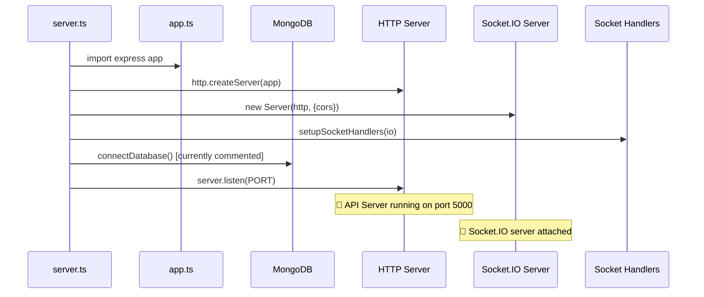

### 4.3 Express Middleware Pipeline

Requests flow through this middleware chain in [app.ts](file:///d:/Personal Projects/letschat-web/apps/api/src/app.ts):

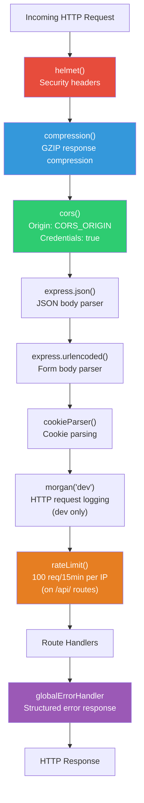

### 4.4 Authentication System

#### JWT Flow

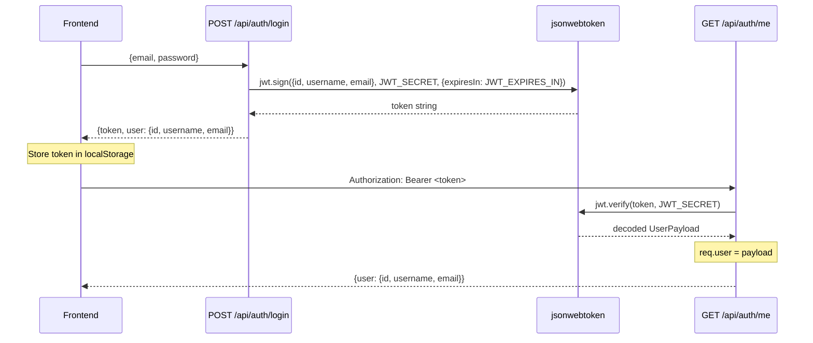

#### Auth Middleware — [auth.ts](file:///d:/Personal Projects/letschat-web/apps/api/src/middlewares/auth.ts)

| Step | Action | Failure Response |
|------|--------|-----------------|
| 1 | Check `Authorization` header exists and starts with `Bearer ` | 401 — "Authentication token missing or invalid" |
| 2 | Extract token after `Bearer ` | — |
| 3 | `jwt.verify(token, JWT_SECRET)` → decode as `UserPayload` | 403 — "Invalid or expired token" |
| 4 | Set `req.user = payload` and call `next()` | — |

### 4.5 Environment Configuration

[env.ts](file:///d:/Personal Projects/letschat-web/apps/api/src/config/env.ts) uses Zod for type-safe, validated environment variables:

| Variable | Type | Default | Validation |
|----------|------|---------|-----------|
| `PORT` | number | `5000` | String → parseInt |
| `NODE_ENV` | enum | `"development"` | `development` \| `production` \| `test` |
| `MONGO_URI` | string | — | Must be a valid URL |
| `JWT_SECRET` | string | — | Minimum 8 characters |
| `JWT_EXPIRES_IN` | string | `"7d"` | — |
| `CORS_ORIGIN` | string | `"http://localhost:3000"` | — |

Environment files are loaded based on `NODE_ENV`:
- Development → `.env.dev`
- Production → `.env.production`

> [!WARNING]
> If environment validation fails, the process exits immediately with a formatted error. This is fail-fast by design.

### 4.6 Socket.IO Real-Time Architecture

#### Event Map — [handler.ts](file:///d:/Personal Projects/letschat-web/apps/api/src/sockets/handler.ts)

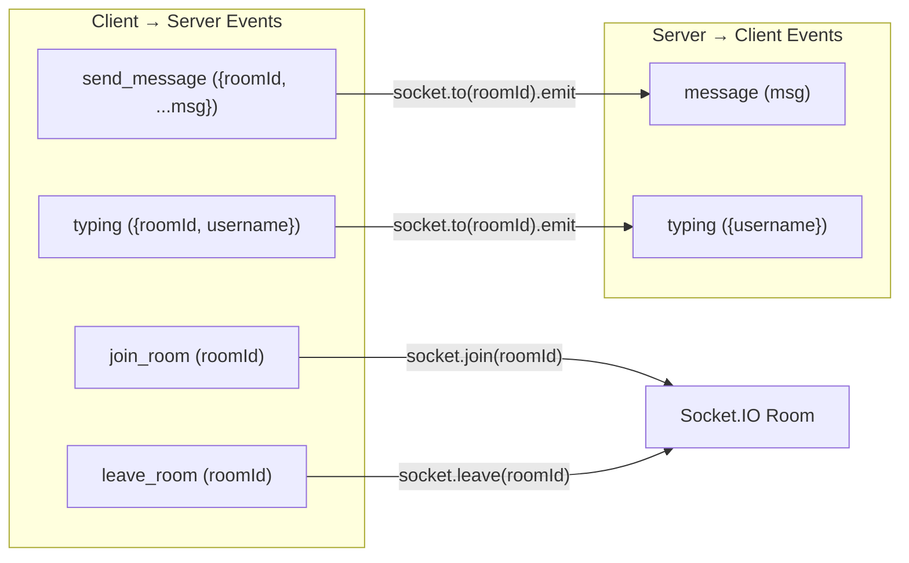

| Event | Direction | Payload | Behavior |
|-------|-----------|---------|----------|
| `connection` | Server ← Client | — | Logs socket ID |
| `join_room` | Client → Server | `roomId: string` | Adds socket to the Socket.IO room |
| `leave_room` | Client → Server | `roomId: string` | Removes socket from the room |
| `send_message` | Client → Server | `{ roomId, ...message }` | Broadcasts to all **other** sockets in the room |
| `typing` | Client → Server | `{ roomId, username }` | Broadcasts typing indicator to the room |
| `message` | Server → Client | `message` object | Received by other participants |
| `typing` | Server → Client | `{ username }` | Shows typing indicator in UI |
| `disconnect` | Server ← Client | — | Logs disconnection |

### 4.7 Error Handling

The [global error handler](file:///d:/Personal Projects/letschat-web/apps/api/src/middlewares/error.ts) catches all unhandled errors in the Express pipeline:

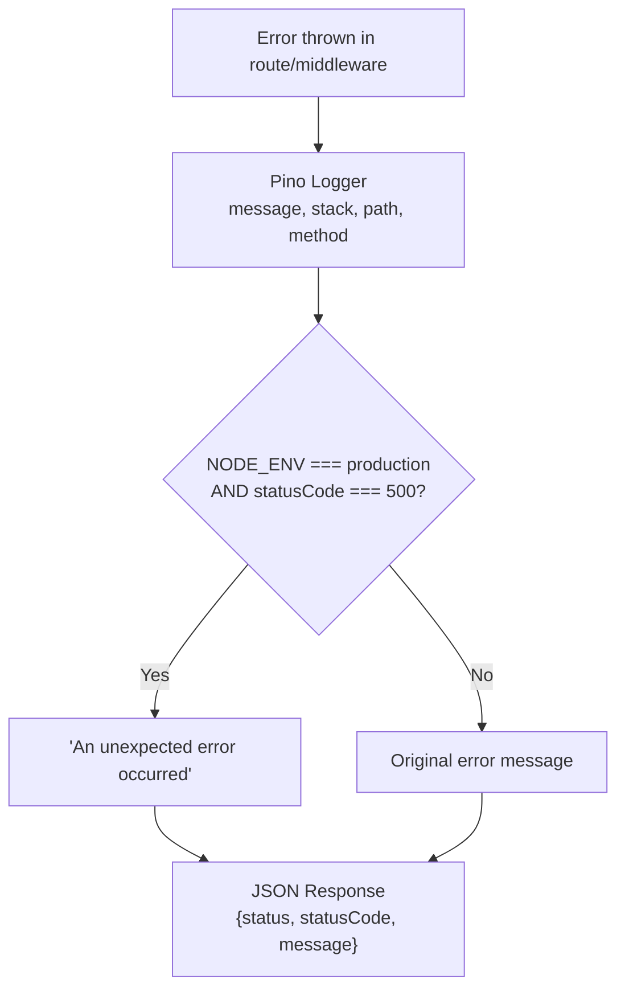

Additionally, [server.ts](file:///d:/Personal Projects/letschat-web/apps/api/src/server.ts) registers process-level handlers:
- `unhandledRejection` → Logs error, continues running
- `uncaughtException` → Logs error, **exits process** (code 1)

### 4.8 API Endpoints (Current)

| Method | Path | Auth | Description |
|--------|------|------|------------|
| `POST` | `/api/auth/login` | ❌ | Login with email/password, returns JWT + user |
| `GET` | `/api/auth/me` | ✅ `authenticateJWT` | Returns authenticated user profile |
| `GET` | `/health` | ❌ | Health check (status + timestamp) |

### 4.9 Planned Backend Layers (Scaffolded)

The backend follows a **layered architecture** pattern, ready for implementation:

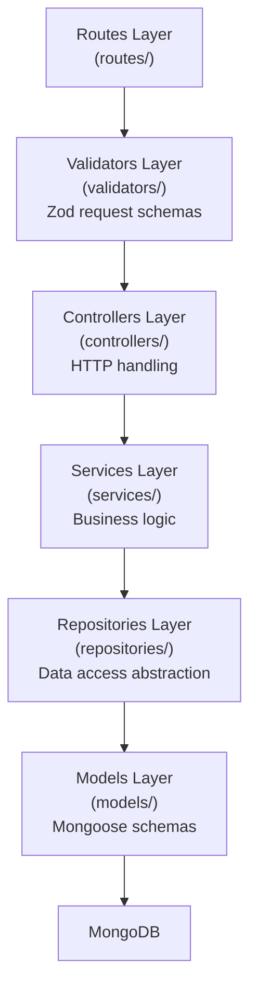

| Layer | Responsibility | Status |
|-------|---------------|--------|
| **Routes** | URL → Controller mapping, middleware attachment | 📋 Scaffolded |
| **Validators** | Zod schemas for request body/params/query validation | 📋 Scaffolded |
| **Controllers** | Parse HTTP request, call service, send HTTP response | 📋 Scaffolded |
| **Services** | Core business logic, orchestration, business rules | 📋 Scaffolded |
| **Repositories** | Database queries, Mongoose operations, data mapping | 📋 Scaffolded |
| **Models** | Mongoose schema definitions, virtuals, middleware | 📋 Scaffolded |

---

## 5. End-to-End Workflows

### 5.1 Application Startup & Authentication Flow

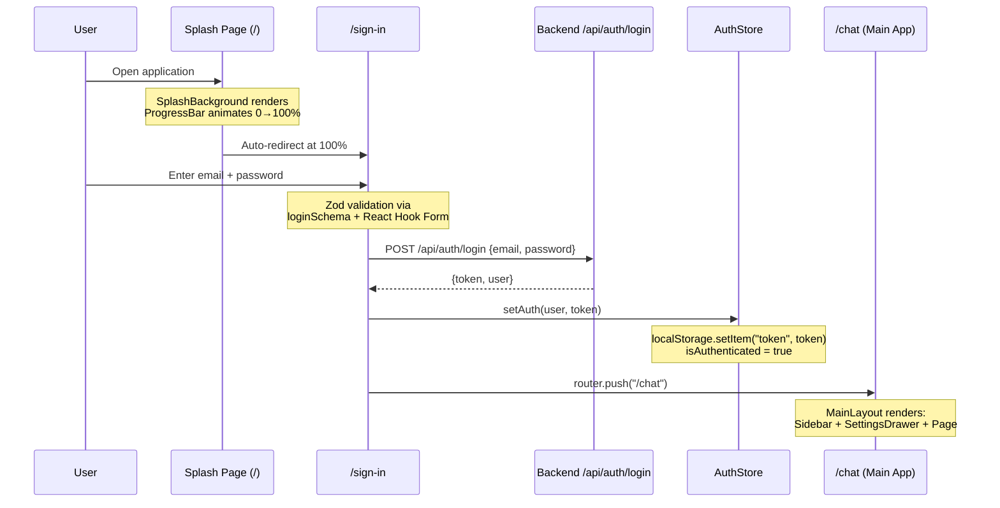

### 5.2 Chat Messaging Flow (Full Lifecycle)

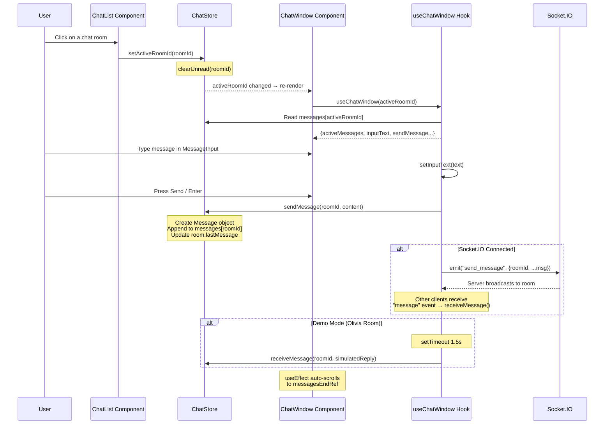

### 5.3 Status Publishing Flow

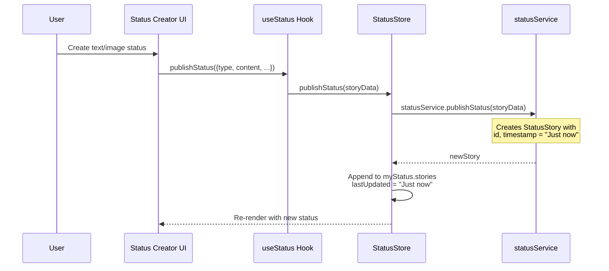

### 5.4 Community Group Chat Flow

```mermaid
sequenceDiagram
    participant User
    participant CommunityList as Community List
    participant Store as CommunitiesStore
    participant GroupChat as Group Chat View

    User->>CommunityList: Select a community
    CommunityList->>Store: setActiveCommunityId(id)

    User->>CommunityList: Select a group
    CommunityList->>Store: selectGroup(communityId, groupId)
    Note over Store: Clear unread for selected group<br/>Set activeGroupId

    Store-->>GroupChat: Re-render with group messages
    GroupChat->>Store: Read groupMessages[groupId]

    User->>GroupChat: Type and send message
    GroupChat->>Store: sendMessageToGroup(communityId, groupId, text)
    Note over Store: Create GroupMessage<br/>Append to groupMessages[groupId]<br/>Update group.lastMessage = "You: text"
```

### 5.5 Channel Interaction Flow

```mermaid
sequenceDiagram
    participant User
    participant ChannelFeed as Channel Feed
    participant Store as ChannelsStore

    User->>ChannelFeed: Click Follow/Unfollow
    ChannelFeed->>Store: toggleFollow(channelId)
    Note over Store: Toggle isFollowed<br/>followers ± 1

    User->>ChannelFeed: React with emoji to story
    ChannelFeed->>Store: reactToStory(channelId, storyId, emoji)
    Note over Store: Find or create reaction<br/>Increment count
```

### 5.6 Voice/Video Call Flow

```mermaid
sequenceDiagram
    participant User
    participant ChatHeader as Chat Header
    participant CallStore as CallStore
    participant ActiveCall as ActiveCallScreen
    participant Hook as useCallScreen

    User->>ChatHeader: Click audio/video call button
    ChatHeader->>CallStore: startCall(name, avatarUrl, "audio"|"video")
    Note over CallStore: isCallActive = true

    CallStore-->>ActiveCall: Render fullscreen overlay
    ActiveCall->>Hook: useCallScreen()
    Note over Hook: Start call timer (mm:ss)<br/>Manage mute/speaker/video state

    User->>ActiveCall: Click End Call
    ActiveCall->>CallStore: endCall()
    Note over CallStore: isCallActive = false
    Note over ActiveCall: Overlay closes
```

---

## 6. Security Architecture

```mermaid
graph TD
    subgraph SecurityLayers["Defense in Depth"]
        L1["Helmet.js<br/>X-Content-Type-Options<br/>X-Frame-Options<br/>Strict-Transport-Security<br/>CSP headers"]
        L2["CORS Policy<br/>Whitelist: CORS_ORIGIN<br/>Credentials: true"]
        L3["Rate Limiting<br/>100 requests / 15 minutes<br/>Per IP address"]
        L4["JWT Authentication<br/>Bearer token in headers<br/>Expiry: 7 days"]
        L5["Zod Validation<br/>Input sanitization<br/>Schema enforcement"]
        L6["Error Sanitization<br/>Production: generic 500 messages<br/>Development: full error details"]
    end

    L1 --> L2 --> L3 --> L4 --> L5 --> L6
```

| Layer | Protection | Implementation |
|-------|-----------|---------------|
| **Transport** | HTTPS headers, HSTS | Helmet.js |
| **Origin** | Cross-origin request control | CORS middleware |
| **Availability** | DDoS/brute-force mitigation | express-rate-limit (100 req/15min) |
| **Authentication** | Stateless user identity | JWT (HS256, 7-day expiry) |
| **Input Validation** | Malformed data rejection | Zod schemas (front + back) |
| **Error Handling** | Information leakage prevention | Generic messages in production |
| **Client Storage** | Token persistence | localStorage with 401 auto-clear |

---

## 7. Routing Map

### Frontend Routes

| Path | Page | Auth Required | Description |
|------|------|--------------|-------------|
| `/` | Splash | ❌ | Animated loader → auto-redirect to `/sign-in` |
| `/sign-in` | Sign In | ❌ | Email/password login form |
| `/sign-up` | Sign Up | ❌ | Registration form |
| `/forgot-password` | Forgot Password | ❌ | Password recovery initiation |
| `/reset-password` | Reset Password | ❌ | New password form |
| `/chat` | Chat | ✅ | Main messaging interface (3-pane) |
| `/status` | Status | ✅ | View/create status stories |
| `/channels` | Channels | ✅ | Browse and follow channels |
| `/communities` | Communities | ✅ | Community groups & messaging |
| `/calls` | Calls | ✅ | Call history & initiation |

### Backend API Routes

| Method | Path | Middleware | Handler |
|--------|------|-----------|---------|
| `POST` | `/api/auth/login` | Rate limiter | Inline (app.ts) |
| `GET` | `/api/auth/me` | Rate limiter + `authenticateJWT` | Inline (app.ts) |
| `GET` | `/health` | None | Inline (app.ts) |

---

## 8. Development & Build Workflow

### Local Development

```mermaid
graph LR
    DEV["npm run dev"]
    TURBO["Turborepo"]
    WEB["apps/web<br/>next dev --port 3000"]
    API["apps/api<br/>tsx watch src/server.ts"]

    DEV --> TURBO
    TURBO --> WEB
    TURBO --> API
```

| Command | Scope | Action |
|---------|-------|--------|
| `npm run dev` | Root | Starts both `web` (port 3000) and `api` (port 5000) in parallel |
| `npm run build` | Root | Builds all packages topologically |
| `npm run lint` | Root | Runs ESLint across all packages |
| `npm run check-types` | Root | TypeScript type checking across all packages |
| `npm run format` | Root | Prettier formatting on `*.{ts,tsx,md}` |

### Environment Setup

```
# apps/api/.env.dev
PORT=5000
MONGO_URI=mongodb://localhost:27017/letschat
JWT_SECRET=<your-secret>
CORS_ORIGIN=http://localhost:3000

# apps/web/.env.dev
NEXT_PUBLIC_API_URL=http://localhost:5000
```

---

## 9. Current State & Architecture Maturity

| Area | Current State | Maturity |
|------|--------------|----------|
| **Frontend UI** | Fully built with all pages, components, animations | 🟢 Complete |
| **State Management** | 7 Zustand stores with persistence | 🟢 Complete |
| **Type System** | Comprehensive TypeScript types for all domains | 🟢 Complete |
| **Form Validation** | Zod schemas + React Hook Form integration | 🟢 Complete |
| **Real-time Client** | Socket.IO provider scaffolded (connection commented out) | 🟡 Ready to activate |
| **API Server** | Express app with security middleware pipeline | 🟡 Foundation ready |
| **Auth Endpoints** | Login + profile routes with JWT | 🟡 Basic (hardcoded) |
| **Socket.IO Server** | Room-based messaging with typing indicators | 🟡 Basic handlers |
| **Database** | Mongoose connection ready (commented out in server.ts) | 🟠 Scaffolded |
| **REST API Layers** | Controllers, services, repositories, models, routes | 🟠 Scaffolded (.gitkeep) |
| **API Validation** | Backend Zod validators | 🟠 Scaffolded (.gitkeep) |

> [!TIP]
> The application is architecturally sound with a clean separation of concerns. The frontend is fully functional in **demo/static mode** with mock data, while the backend has its foundation and security layers in place, ready for the data-persistence layers to be implemented.
