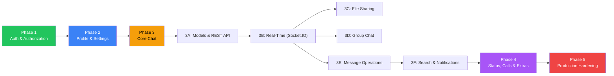

# Let's Chat — Implementation Plan

> Step-by-step build plan organized by your priority order. Each phase lists **exactly** what to build, in what order, on which side (backend/frontend), and how to verify it works.

---

## Priority & Dependency Map

---

## Phase 1 — Authentication & Authorization

> **Goal**: Users can register, verify email, log in, recover passwords, and all protected routes are secured with JWT.

---

### 1.1 — Backend: User Model & Password Hashing

**What to build**: The User mongoose model with bcrypt password hashing.

**Backend tasks:**

- [ ] Install dependencies: `bcryptjs`, `@types/bcryptjs`
- [ ] Create `apps/api/src/models/User.ts`
  - Define schema: `username`, `email`, `password` (select: false), `displayName`, `avatar`, `about`, `isOnline`, `lastSeen`, `isVerified`, `verificationToken`, `resetToken`, `resetTokenExpiry`, `refreshTokens[]`, `pushToken`, `soundEnabled`
  - Add pre-save hook: hash password with `bcrypt.hash(password, 12)` if modified
  - Add instance method: `comparePassword(candidate)` → `bcrypt.compare()`
  - Add indexes: `{ email: 1 }` (unique), `{ username: 1 }` (unique)
- [ ] Create `apps/api/src/validators/auth.validator.ts`
  - `registerSchema`: Zod schema for `{ username, email, password }`
  - `loginSchema`: Zod schema for `{ email, password }`
  - `forgotPasswordSchema`: `{ email }`
  - `resetPasswordSchema`: `{ token, newPassword }`
- [ ] Create `apps/api/src/middlewares/validate.ts`
  - Generic middleware factory: `validate(schema)` → parses `req.body` with Zod, returns 400 on failure

**Verify**: Write a quick scratch script that creates a user in MongoDB and verifies the password hash works.

---

### 1.2 — Backend: Registration & Email Verification

**What to build**: Register endpoint + email verification.

**Backend tasks:**

- [ ] Install dependencies: `resend` (or `nodemailer` + SMTP)
- [ ] Create `apps/api/src/services/email.service.ts`
  - `sendVerificationEmail(email, token)` — sends email with verification link
  - `sendPasswordResetEmail(email, token)` — sends reset link
  - Use HTML email templates with the app branding
- [ ] Create `apps/api/src/utils/token.ts`
  - `generateRandomToken()` — `crypto.randomBytes(32).toString('hex')`
  - `generateAccessToken(payload)` — `jwt.sign(payload, secret, { expiresIn: '15m' })`
  - `generateRefreshToken(payload)` — `jwt.sign(payload, refreshSecret, { expiresIn: '7d' })`
- [ ] Create `apps/api/src/repositories/user.repository.ts`
  - `findByEmail(email)`, `findById(id)`, `create(data)`, `updateById(id, data)`
  - All DB queries go through repository — controllers never touch Mongoose directly
- [ ] Create `apps/api/src/services/auth.service.ts`
  - `register({ username, email, password })`:
    1. Check if email/username already exists → 409 Conflict
    2. Create user document (password auto-hashed by pre-save hook)
    3. Generate verification token, save to user
    4. Send verification email
    5. Return `{ message: "Check your email to verify your account" }`
  - `verifyEmail(token)`:
    1. Find user by `verificationToken`
    2. Set `isVerified = true`, clear `verificationToken`
- [ ] Create `apps/api/src/controllers/auth.controller.ts`
  - `register(req, res)` — calls `authService.register()`, returns 201
  - `verifyEmail(req, res)` — calls `authService.verifyEmail()`, returns 200
- [ ] Create `apps/api/src/routes/auth.routes.ts`
  - `POST /api/auth/register` → `validate(registerSchema)` → `authController.register`
  - `GET /api/auth/verify/:token` → `authController.verifyEmail`
- [ ] Register routes in `app.ts`: `app.use('/api/auth', authRoutes)`
- [ ] Remove the existing hardcoded login/me routes from `app.ts`

**Verify**: Use Postman/Thunder Client to register a user, check MongoDB for the document, check email delivery.

---

### 1.3 — Backend: Login & Token System

**What to build**: Login endpoint with access token + refresh token + cookie-based refresh.

**Backend tasks:**

- [ ] Add to `apps/api/src/config/env.ts`:
  - `JWT_REFRESH_SECRET` (separate from JWT_SECRET)
  - `CLIENT_URL` (for email links and CORS)
- [ ] Add to `apps/api/src/services/auth.service.ts`:
  - `login({ email, password })`:
    1. Find user by email (select +password)
    2. Check `isVerified` → 403 "Please verify your email"
    3. `bcrypt.compare(password, user.password)` → 401 on mismatch
    4. Generate `accessToken` (15 min) and `refreshToken` (7 days)
    5. Hash refresh token, push to `user.refreshTokens[]` with expiry + device info
    6. Return `{ accessToken, user: { id, username, email, avatar, about } }`
    7. Set `refreshToken` as HTTP-only secure cookie
  - `refreshToken(existingToken)`:
    1. Verify JWT → get payload
    2. Find user, verify hashed token exists in `refreshTokens[]`
    3. Remove old token from array (rotation)
    4. Generate new `accessToken` + new `refreshToken`
    5. Push new hashed refresh token to array
    6. Return new tokens
  - `logout(userId, refreshToken)`:
    1. Remove matching refresh token from `user.refreshTokens[]`
    2. Clear the cookie
- [ ] Update `apps/api/src/controllers/auth.controller.ts`:
  - `login(req, res)` — calls service, sets refresh cookie: `res.cookie('refreshToken', token, { httpOnly: true, secure: true, sameSite: 'strict', maxAge: 7 * 24 * 60 * 60 * 1000 })`
  - `refresh(req, res)` — reads `req.cookies.refreshToken`, returns new access token
  - `logout(req, res)` — clears cookie
- [ ] Update `apps/api/src/routes/auth.routes.ts`:
  - `POST /api/auth/login` → `validate(loginSchema)` → `authController.login`
  - `POST /api/auth/refresh` → `authController.refresh`
  - `POST /api/auth/logout` → `authenticateJWT` → `authController.logout`
- [ ] Update `apps/api/src/middlewares/auth.ts`:
  - Read token from `Authorization: Bearer <token>` header
  - Verify against `JWT_SECRET` (not refresh secret)
  - Attach `req.user = { id, username, email }`

**Verify**: Test full flow — register → verify email → login → get access token + cookie → use access token for protected route → refresh when expired → logout.

---

### 1.4 — Backend: Password Recovery

**Backend tasks:**

- [ ] Add to `apps/api/src/services/auth.service.ts`:
  - `forgotPassword(email)`:
    1. Find user by email
    2. Generate reset token + expiry (1 hour)
    3. Save to user document
    4. Send password reset email with link: `{CLIENT_URL}/reset-password?token={token}`
  - `resetPassword(token, newPassword)`:
    1. Find user by `resetToken` where `resetTokenExpiry > now`
    2. Set new password (pre-save hook hashes it)
    3. Clear `resetToken` and `resetTokenExpiry`
    4. Clear all `refreshTokens[]` (force re-login on all devices)
- [ ] Update `apps/api/src/controllers/auth.controller.ts`:
  - `forgotPassword(req, res)` — always returns 200 (don't leak whether email exists)
  - `resetPassword(req, res)` — validates token + new password
- [ ] Update `apps/api/src/routes/auth.routes.ts`:
  - `POST /api/auth/forgot-password` → `validate(forgotPasswordSchema)` → controller
  - `POST /api/auth/reset-password` → `validate(resetPasswordSchema)` → controller

**Verify**: Full flow — forgot password → check email → click link → reset → login with new password.

---

### 1.5 — Frontend: Connect Auth Pages to Real API

**What to build**: Replace the static auth forms with real API calls.

**Frontend tasks:**

- [ ] Create `apps/web/src/services/auth-service.ts`
  - `login(email, password)` → `POST /api/auth/login`
  - `register(username, email, password)` → `POST /api/auth/register`
  - `forgotPassword(email)` → `POST /api/auth/forgot-password`
  - `resetPassword(token, newPassword)` → `POST /api/auth/reset-password`
  - `refreshToken()` → `POST /api/auth/refresh` (with credentials for cookie)
  - `logout()` → `POST /api/auth/logout`
  - `getMe()` → `GET /api/users/me`
- [ ] Create `apps/web/src/hooks/api/use-auth.ts`
  - `useLogin()` → React Query `useMutation` wrapping `authService.login()`
  - `useRegister()` → `useMutation` wrapping `authService.register()`
  - `useLogout()` → `useMutation` wrapping `authService.logout()`
- [ ] Update `apps/web/src/store/auth-store.ts`:
  - Store `accessToken` in Zustand **in memory only** (remove localStorage for token)
  - Remove hardcoded default user
  - `setAuth(user, accessToken)` — set in-memory token
  - `logout()` — clear state, call logout API
- [ ] Update `apps/web/src/lib/axios.ts`:
  - Request interceptor: read token from `useAuthStore.getState().token` instead of localStorage
  - Response interceptor on 401: attempt `authService.refreshToken()` → retry original request → if refresh fails → logout
  - Add `withCredentials: true` to axios config (for cookies)
- [ ] Update `apps/web/src/components/auth/SignInForm.tsx`:
  - Use `useLogin()` mutation instead of mock
  - Show loading state on submit button
  - Handle error responses (invalid credentials, unverified email)
  - On success: `authStore.setAuth(user, token)` → `router.push('/chat')`
- [ ] Update `apps/web/src/components/auth/SignUpForm.tsx`:
  - Use `useRegister()` mutation
  - On success: show "Check your email" message → redirect to `/sign-in`
- [ ] Update `apps/web/src/components/auth/ForgotPasswordForm.tsx`:
  - Connect to real API
  - Show success toast regardless (security — don't leak email existence)
- [ ] Update `apps/web/src/components/auth/ResetPasswordForm.tsx`:
  - Read `token` from URL query params
  - Call reset password API
  - On success: redirect to `/sign-in` with success message

**Verify**: Full end-to-end flow in the browser — register → verify → login → see chat page → refresh page (token refreshes via cookie) → logout.

---

### 1.6 — Frontend: Route Protection & Auth Guard

**Frontend tasks:**

- [ ] Create `apps/web/src/providers/auth-provider.tsx`
  - On mount: call `authService.getMe()` to check if session is valid (refresh cookie auto-sent)
  - If valid: set user in auth store, render children
  - If invalid: redirect to `/sign-in`
  - Show loading skeleton while checking
- [ ] Create `apps/web/src/components/auth/AuthGuard.tsx`
  - Wrapper component that checks `isAuthenticated` from auth store
  - If not authenticated → redirect to `/sign-in`
  - If authenticated → render children
- [ ] Update `apps/web/src/app/(main)/layout.tsx`:
  - Wrap with `AuthGuard`
- [ ] Update `apps/web/src/app/page.tsx` (splash):
  - After loading animation: check if authenticated → go to `/chat`, else → go to `/sign-in`
- [ ] Set up automatic token refresh timer:
  - In `auth-provider.tsx`: set `setInterval` to call `refreshToken()` every 13 minutes (before 15-min access token expires)
  - Clear interval on unmount

**Verify**: 
- Open `/chat` without logging in → redirected to `/sign-in`
- Log in → access `/chat` → refresh page → still logged in (cookie refresh works)
- Wait 15+ minutes → access token auto-refreshes silently
- Log out → redirected to `/sign-in` → can't access `/chat`

---

## Phase 2 — User Profile & Settings

> **Goal**: Users can view/edit their profile, upload avatars, and manage app settings.

---

### 2.1 — Backend: User Profile API

**Backend tasks:**

- [ ] Create `apps/api/src/validators/user.validator.ts`
  - `updateProfileSchema`: `{ displayName?, about?, soundEnabled? }`
  - `changePasswordSchema`: `{ currentPassword, newPassword }`
- [ ] Create `apps/api/src/services/user.service.ts`
  - `getProfile(userId)` — fetch user by ID, exclude sensitive fields
  - `updateProfile(userId, data)` — update allowed fields only
  - `changePassword(userId, currentPassword, newPassword)`:
    1. Fetch user with `select('+password')`
    2. Verify current password with bcrypt
    3. Set new password (pre-save hook hashes)
    4. Invalidate all refresh tokens (force re-login)
  - `searchUsers(query, currentUserId)` — find users by username/email, exclude self
  - `deleteAccount(userId)` — soft-delete or hard-delete user + cleanup
- [ ] Create `apps/api/src/controllers/user.controller.ts`
  - `getMe(req, res)` — return `req.user` full profile
  - `updateMe(req, res)` — update profile
  - `changePassword(req, res)`
  - `searchUsers(req, res)` — query param `?q=searchterm`
  - `deleteAccount(req, res)`
- [ ] Create `apps/api/src/routes/user.routes.ts`
  - `GET /api/users/me` → `authenticateJWT` → `userController.getMe`
  - `PATCH /api/users/me` → `authenticateJWT` → `validate(updateProfileSchema)` → `userController.updateMe`
  - `PATCH /api/users/me/password` → `authenticateJWT` → `validate(changePasswordSchema)` → `userController.changePassword`
  - `GET /api/users/search?q=` → `authenticateJWT` → `userController.searchUsers`
  - `DELETE /api/users/me` → `authenticateJWT` → `userController.deleteAccount`
- [ ] Register in `app.ts`: `app.use('/api/users', userRoutes)`

**Verify**: Postman — get profile, update display name, change password, search users.

---

### 2.2 — Backend: Avatar Upload

**Backend tasks:**

- [ ] Install dependencies: `multer`, `sharp`, `@aws-sdk/client-s3` (or `cloudinary`)
- [ ] Create `apps/api/src/config/storage.ts`
  - Configure S3 client (or Cloudinary SDK)
  - Export `uploadToS3(buffer, key, contentType)` → returns URL
  - Export `deleteFromS3(key)`
- [ ] Create `apps/api/src/middlewares/upload.ts`
  - Multer config with `memoryStorage()` (files stay in memory as buffers)
  - File filter: allow only `image/jpeg`, `image/png`, `image/webp`
  - Size limit: 5 MB for avatars
  - Export `uploadAvatar` middleware (single file, field name `'avatar'`)
- [ ] Create `apps/api/src/services/upload.service.ts`
  - `processAndUploadAvatar(buffer, userId)`:
    1. Use Sharp: resize to 400x400, crop center, convert to WebP, quality 80%
    2. Generate thumbnail: 100x100
    3. Upload both to S3: `avatars/{userId}/avatar.webp`, `avatars/{userId}/thumb.webp`
    4. Return `{ avatarUrl, thumbnailUrl }`
  - `processAndUploadMedia(buffer, filename, mimetype)`:
    1. If image: resize to max 1920px, generate 200px thumbnail
    2. Upload to S3: `media/{timestamp}_{filename}`
    3. Return `{ url, thumbnailUrl, size, width, height }`
- [ ] Add to `apps/api/src/controllers/user.controller.ts`:
  - `uploadAvatar(req, res)`:
    1. Get `req.file.buffer`
    2. Call `uploadService.processAndUploadAvatar()`
    3. Update user's `avatar` field in DB
    4. Return new avatar URL
- [ ] Add to `apps/api/src/routes/user.routes.ts`:
  - `POST /api/users/me/avatar` → `authenticateJWT` → `uploadAvatar` (multer) → `userController.uploadAvatar`

**Verify**: Upload an image via Postman form-data → check S3/Cloudinary for processed file → verify user document updated.

---

### 2.3 — Frontend: Profile & Settings Connected to API

**Frontend tasks:**

- [ ] Create `apps/web/src/services/user-service.ts`
  - `getMe()` → `GET /api/users/me`
  - `updateProfile(data)` → `PATCH /api/users/me`
  - `uploadAvatar(file)` → `POST /api/users/me/avatar` (FormData)
  - `changePassword(data)` → `PATCH /api/users/me/password`
  - `deleteAccount()` → `DELETE /api/users/me`
- [ ] Create `apps/web/src/hooks/api/use-user.ts`
  - `useCurrentUser()` → `useQuery(['user', 'me'], userService.getMe)`
  - `useUpdateProfile()` → `useMutation` with optimistic update on query cache
  - `useUploadAvatar()` → `useMutation` with progress tracking
  - `useChangePassword()` → `useMutation`
- [ ] Update `apps/web/src/components/sidebar/SettingsDrawer.tsx`:
  - **Profile section**: show avatar (from API), display name, about — all editable
  - **Avatar upload**: click avatar → file picker → preview → upload → show new avatar
  - **Password change**: current password + new password form
  - **Sound toggle**: connected to user settings API
  - **Delete account**: confirmation modal → call API → logout
- [ ] Update settings-views components:
  - Connect each settings form to real API calls via hooks
  - Show success/error toasts via Sonner
  - Loading states during saves
- [ ] Update auth-store default user:
  - Remove the hardcoded "John Doe" user
  - Populate from `useCurrentUser()` query result

**Verify**: Edit display name → refresh → change persists. Upload avatar → see new image. Change password → log out → log in with new password.

---

## Phase 3 — Core Chat System

> **Goal**: Full real-time messaging — conversations, messages, typing indicators, presence, read receipts, file sharing, groups, search, and push notifications.

---

### 3A — Conversation & Message Models + REST API

---

#### 3A.1 — Backend: Data Models

**Backend tasks:**

- [ ] Create `apps/api/src/models/Conversation.ts`
  - Schema: `type` (direct/group), `name`, `avatar`, `description`, `createdBy`, `participants[]` (embedded: userId, role, joinedAt, mutedUntil, isArchived), `lastMessage` (denormalized: content, senderId, timestamp, type), `pinnedMessages[]`, `isActive`
  - Indexes: `{ 'participants.userId': 1, updatedAt: -1 }`
- [ ] Create `apps/api/src/models/Message.ts`
  - Schema: `conversationId`, `senderId`, `type` (text/image/audio/video/document/system), `content`, `attachments[]` (url, thumbnail, filename, mimeType, size, duration, width, height), `replyTo`, `reactions[]` (emoji, userIds), `deliveredTo[]`, `readBy[]`, `isEdited`, `isDeleted`, `deletedAt`
  - Indexes: `{ conversationId: 1, createdAt: -1 }` (primary query), `{ senderId: 1 }`

**Verify**: Create test documents in MongoDB Compass, verify indexes.

---

#### 3A.2 — Backend: Conversation REST API

**Backend tasks:**

- [ ] Create `apps/api/src/repositories/conversation.repository.ts`
  - `findByUserId(userId, options)` — paginated, sorted by `updatedAt`, populate participant avatars
  - `findById(id)` — with participant details
  - `create(data)` — create conversation
  - `updateLastMessage(conversationId, message)` — update denormalized field
  - `addParticipant(conversationId, userId, role)`
  - `removeParticipant(conversationId, userId)`
  - `isParticipant(conversationId, userId)` — authorization check
- [ ] Create `apps/api/src/validators/conversation.validator.ts`
  - `createConversationSchema`: `{ type, participantIds[], name?, description? }`
  - `updateConversationSchema`: `{ name?, description?, avatar? }`
- [ ] Create `apps/api/src/services/conversation.service.ts`
  - `getUserConversations(userId, page, limit)`:
    1. Find all conversations where userId is a participant
    2. Populate participant user details (username, avatar, isOnline)
    3. Sort by `lastMessage.timestamp` descending
    4. Return paginated results
  - `createDirectConversation(userId, targetUserId)`:
    1. Check if direct conversation already exists between these two users
    2. If exists, return existing
    3. If not, create new with `type: 'direct'`, both as participants
  - `createGroupConversation(userId, { name, participantIds })`:
    1. Create with `type: 'group'`, creator as admin
    2. Add all participants as members
  - `getConversationById(conversationId, userId)`:
    1. Find conversation
    2. Verify userId is a participant → 403 if not
- [ ] Create `apps/api/src/controllers/conversation.controller.ts`
- [ ] Create `apps/api/src/routes/conversation.routes.ts`
  - `GET /api/conversations` → list user's conversations
  - `POST /api/conversations` → create new conversation
  - `GET /api/conversations/:id` → get conversation details

**Verify**: Create a direct conversation between two users via Postman → list conversations → verify it appears for both users.

---

#### 3A.3 — Backend: Message REST API

**Backend tasks:**

- [ ] Create `apps/api/src/repositories/message.repository.ts`
  - `findByConversation(conversationId, cursor, limit)` — cursor-based pagination (before/after a message ID)
  - `create(data)` — create message
  - `findById(id)`
  - `updateById(id, data)` — for edits
  - `softDelete(id)` — set `isDeleted = true`
- [ ] Create `apps/api/src/validators/message.validator.ts`
  - `sendMessageSchema`: `{ content?, type, replyTo? }` (content required for text, optional for media)
- [ ] Create `apps/api/src/services/message.service.ts`
  - `sendMessage(senderId, conversationId, { content, type, attachments, replyTo })`:
    1. Verify sender is participant of conversation
    2. Create message document
    3. Update conversation's `lastMessage` denormalized field
    4. Return created message (populated with sender info)
  - `getMessages(conversationId, userId, { cursor, limit })`:
    1. Verify userId is participant
    2. Fetch messages with cursor-based pagination
    3. Populate sender info (username, avatar)
    4. Return `{ messages, nextCursor, hasMore }`
- [ ] Create `apps/api/src/controllers/message.controller.ts`
- [ ] Create `apps/api/src/routes/message.routes.ts`
  - `GET /api/conversations/:id/messages?cursor=&limit=` → get messages
  - `POST /api/conversations/:id/messages` → send message

**Verify**: Send messages via Postman → fetch messages with pagination → verify cursor-based loading works.

---

#### 3A.4 — Frontend: Connect Chat List to Real API

**Frontend tasks:**

- [ ] Create `apps/web/src/services/conversation-service.ts`
  - `getConversations(page)` → `GET /api/conversations`
  - `createConversation(data)` → `POST /api/conversations`
  - `getConversation(id)` → `GET /api/conversations/:id`
- [ ] Create `apps/web/src/services/message-service.ts`
  - `getMessages(conversationId, cursor)` → `GET /api/conversations/:id/messages`
  - `sendMessage(conversationId, data)` → `POST /api/conversations/:id/messages`
- [ ] Create `apps/web/src/hooks/api/use-conversations.ts`
  - `useConversations()` → `useQuery(['conversations'], ...)`
  - `useCreateConversation()` → `useMutation` + invalidate conversations query
- [ ] Create `apps/web/src/hooks/api/use-messages.ts`
  - `useMessages(conversationId)` → `useInfiniteQuery(['messages', convId], ...)` with cursor-based pagination
  - `useSendMessage()` → `useMutation` with **optimistic update** (append message immediately, rollback on failure)
- [ ] Update `apps/web/src/store/chat-store.ts`:
  - Remove `rooms` and `messages` from store (these now come from React Query)
  - Keep only `activeRoomId` → rename to `activeConversationId`
  - Remove mock data imports
- [ ] Update `apps/web/src/components/chat-list/ChatList.tsx`:
  - Fetch conversations from `useConversations()` instead of Zustand store
  - Show loading skeletons while fetching
  - Show empty state if no conversations
- [ ] Update `apps/web/src/components/chat-window/ChatWindow.tsx`:
  - Fetch messages from `useMessages(conversationId)` instead of Zustand
  - Implement infinite scroll — load more messages when scrolling to top
  - Maintain scroll position when older messages load
- [ ] Update `apps/web/src/components/chat-window/MessageInput.tsx`:
  - Use `useSendMessage()` mutation
  - Optimistic update: show message immediately with "sending" status
  - On success: update status to "sent"
  - On failure: show retry button
- [ ] Create "New Chat" flow:
  - Add "New Chat" button in chat list header
  - Open user search dialog → search users via `/api/users/search?q=`
  - Select user → call `createConversation({ type: 'direct', participantIds: [userId] })`
  - Navigate to new conversation
- [ ] Remove `apps/web/src/constants/mock-data.ts` (no longer needed)

**Verify**: Open app → see real conversations from DB → click a conversation → see real messages → send a message → it persists on refresh → scroll up to load older messages.

---

### 3B — Real-Time Messaging (Socket.IO)

---

#### 3B.1 — Backend: Socket.IO Infrastructure

**Backend tasks:**

- [ ] Install: `ioredis`, `@socket.io/redis-adapter`
- [ ] Create `apps/api/src/config/redis.ts`
  - Create Redis client from `REDIS_URL` env variable
  - Export client for use across services
- [ ] Update `apps/api/src/sockets/handler.ts` — complete rewrite:
  - **Auth middleware**: verify JWT from `socket.handshake.auth.token`
  - **On connection**:
    1. Mark user online in Redis: `SADD online_users {userId}`
    2. Store socket mapping: `HSET user_sockets:{userId} {socketId} {device}`
    3. Update user `isOnline = true` in MongoDB
    4. Join personal room: `socket.join(\`user:${userId}\`)`
    5. Fetch user's conversation IDs, join each: `socket.join(\`conv:${convId}\`)`
    6. Broadcast `user_online` to user's contacts
  - **On disconnect**:
    1. Remove socket: `HDEL user_sockets:{userId} {socketId}`
    2. Check if any sockets remain: `HLEN user_sockets:{userId}`
    3. If zero: `SREM online_users {userId}`, update MongoDB `isOnline = false, lastSeen = now`
    4. Broadcast `user_offline` to contacts
- [ ] Create `apps/api/src/sockets/events/` directory:
  - `message.events.ts` — handle `send_message`, `message_delivered`, `message_read`
  - `typing.events.ts` — handle `typing_start`, `typing_stop`
  - `call.events.ts` — handle call signaling (placeholder for Phase 4)
- [ ] Update `apps/api/src/server.ts`:
  - Attach Redis adapter to Socket.IO
  - `io.adapter(createAdapter(pubClient, subClient))`
- [ ] Add `apps/api/src/services/socket.service.ts`:
  - `emitToConversation(conversationId, event, data)` — `io.to(\`conv:${convId}\`).emit(event, data)`
  - `emitToUser(userId, event, data)` — `io.to(\`user:${userId}\`).emit(event, data)`
  - `isUserOnline(userId)` — `SISMEMBER online_users {userId}`

**Verify**: Connect two browser tabs as different users → both show as "online" → disconnect one → shows "offline".

---

#### 3B.2 — Backend: Real-Time Message Delivery

**Backend tasks:**

- [ ] In `apps/api/src/sockets/events/message.events.ts`:
  - `send_message` handler:
    1. Validate message data
    2. Call `messageService.sendMessage()` — saves to DB
    3. Emit `new_message` to the conversation room (excluding sender)
    4. Emit `new_message` back to sender with `status: 'sent'` (confirmation)
    5. For each offline participant: queue push notification
  - `message_delivered` handler:
    1. Update message's `deliveredTo[]` array
    2. Emit `message_delivered_receipt` to sender's personal room
  - `message_read` handler:
    1. Update message's `readBy[]` array (batch — mark all messages up to this one)
    2. Emit `message_read_receipt` to sender's personal room

**Verify**: Two users chatting — User A sends message → User B receives instantly → User B opens conversation → User A sees blue ticks.

---

#### 3B.3 — Backend: Typing Indicators

**Backend tasks:**

- [ ] In `apps/api/src/sockets/events/typing.events.ts`:
  - `typing_start`:
    1. Set Redis key `typing:{convId}:{userId}` with TTL 5 seconds
    2. Emit `typing_indicator` to conversation room (excluding sender)
  - `typing_stop`:
    1. Delete Redis key
    2. Emit `typing_stopped` to room

**Verify**: User A types → User B sees "User A is typing..." → User A stops → indicator disappears.

---

#### 3B.4 — Frontend: Socket.IO Integration

**Frontend tasks:**

- [ ] Update `apps/web/src/lib/socket.ts` (new file):
  - Create Socket.IO client instance (not connected yet)
  - Export `connectSocket(token)`, `disconnectSocket()`, `getSocket()`
- [ ] Update `apps/web/src/providers/socket-provider.tsx`:
  - Remove the commented-out code
  - On auth state change (user logs in): call `connectSocket(accessToken)`
  - On logout: call `disconnectSocket()`
  - Pass socket instance via context
  - Track `isConnected` state
  - Show connection status indicator in sidebar
- [ ] Create `apps/web/src/hooks/socket/use-socket-messages.ts`:
  - Listen for `new_message` event
  - On receive: update React Query cache — `queryClient.setQueryData(['messages', convId], ...)` to append message
  - Also update conversations list cache (update lastMessage)
  - Emit `message_delivered` when message arrives while conversation is NOT active
  - Emit `message_read` when message arrives while conversation IS active
- [ ] Create `apps/web/src/hooks/socket/use-typing.ts`:
  - `startTyping(conversationId)` — emit `typing_start`, debounced
  - `stopTyping(conversationId)` — emit `typing_stop`
  - Listen for `typing_indicator` / `typing_stopped` events
  - Store typing state in `realtime-store.ts`
- [ ] Create `apps/web/src/hooks/socket/use-presence.ts`:
  - Listen for `user_online` / `user_offline` events
  - Maintain online users set in `realtime-store.ts`
  - Provide `isOnline(userId)` helper
- [ ] Create `apps/web/src/store/realtime-store.ts`:
  - `onlineUsers: Set<string>` — user IDs currently online
  - `typingUsers: Map<string, string[]>` — conversationId → list of typing usernames
  - Actions: `setUserOnline`, `setUserOffline`, `setTyping`, `clearTyping`
- [ ] Update `apps/web/src/components/chat-window/MessageInput.tsx`:
  - On input change: call `startTyping(conversationId)` (debounced)
  - On blur or send: call `stopTyping(conversationId)`
- [ ] Create `apps/web/src/components/chat-window/TypingIndicator.tsx`:
  - Read typing users for current conversation from realtime-store
  - Show animated "User is typing..." with bouncing dots
- [ ] Update `apps/web/src/components/chat-window/MessageBubble.tsx`:
  - Show delivery status: ⏳ sending → ✓ sent → ✓✓ delivered → 🔵✓✓ read
- [ ] Update `apps/web/src/components/chat-list/ChatRoomItem.tsx`:
  - Show online indicator (green dot) from presence store
  - Show typing indicator if someone is typing in this conversation

**Verify**: Open two browser windows as different users → send messages in real-time → see typing indicators → see online/offline status → see read receipts.

---

### 3C — File Sharing in Chat

---

#### 3C.1 — Backend: Media Upload for Messages

**Backend tasks:**

- [ ] Create `apps/api/src/routes/upload.routes.ts`:
  - `POST /api/upload` → `authenticateJWT` → multer (multiple files, 25MB limit) → `uploadController.upload`
- [ ] Create `apps/api/src/controllers/upload.controller.ts`:
  - Process each file through `uploadService`
  - Return array of `{ url, thumbnailUrl, filename, mimeType, size, width?, height?, duration? }`
- [ ] Update message creation to accept `attachments[]` array with S3 URLs

**Verify**: Upload an image via Postman → receive S3 URL → send message with attachment URL → verify message renders with image.

---

#### 3C.2 — Frontend: File Upload in Chat

**Frontend tasks:**

- [ ] Create `apps/web/src/services/upload-service.ts`
  - `uploadFiles(files: File[])` → `POST /api/upload` with `FormData`, track upload progress
- [ ] Create `apps/web/src/hooks/ui/use-media-upload.ts`
  - Handle file selection (drag-drop or file picker)
  - Preview before send (local `URL.createObjectURL()`)
  - Upload progress tracking
  - Return `{ selectFiles, previews, uploadProgress, upload, cancel }`
- [ ] Update `apps/web/src/components/chat-window/MessageInput.tsx`:
  - Add attachment button → opens file picker
  - Show file preview bar above input
  - On send: first upload files → get URLs → then send message with attachment URLs
  - Show upload progress bar
- [ ] Update `apps/web/src/components/chat-window/MessageBubble.tsx`:
  - Render image attachments with lightbox preview
  - Render document attachments with download link + file icon
  - Render audio attachments with the existing `AudioPlayBubble` component
  - Render video with inline player

**Verify**: Send an image → other user sees the image → click to expand → send a document → other user can download it.

---

### 3D — Group Chat

---

#### 3D.1 — Backend: Group Operations

**Backend tasks:**

- [ ] Add to `apps/api/src/services/conversation.service.ts`:
  - `addParticipants(conversationId, userId, participantIds)`:
    1. Verify requester is admin
    2. Add participants with `role: 'member'`
    3. Create system message: "User X added User Y"
    4. Emit `conversation_updated` via Socket.IO
  - `removeParticipant(conversationId, adminId, targetUserId)`:
    1. Verify requester is admin (or targetUserId === self for "leave")
    2. Remove participant
    3. System message: "User X removed User Y" or "User Y left"
  - `updateGroup(conversationId, userId, { name, description, avatar })`:
    1. Verify requester is admin
    2. Update conversation
    3. System message: "User X changed the group name to ..."
  - `promoteToAdmin(conversationId, adminId, targetUserId)`
- [ ] Add routes:
  - `POST /api/conversations/:id/participants` → add members
  - `DELETE /api/conversations/:id/participants/:userId` → remove/leave
  - `PATCH /api/conversations/:id` → update group info
- [ ] Handle system messages:
  - Create `apps/api/src/utils/system-messages.ts`
  - Functions to generate system message content for group events

---

#### 3D.2 — Frontend: Group Chat UI

**Frontend tasks:**

- [ ] Create "New Group" flow:
  - Multi-select user search → set group name → create
- [ ] Update chat header for groups:
  - Show member count
  - Show group avatar + name
  - "Group Info" button → opens details panel
- [ ] Update details panel for groups:
  - Show all members with roles (admin badge)
  - "Add Members" button (admin only)
  - "Remove" button next to members (admin only)
  - "Leave Group" button
  - Edit group name/avatar (admin only)
- [ ] Render system messages:
  - Different bubble style for "User X added User Y", "User X left", etc.
  - Centered, no sender info, muted color

**Verify**: Create a group → add members → all members see the group → send messages → add/remove members → system messages appear.

---

### 3E — Message Operations

---

#### 3E.1 — Backend: Edit, Delete, React, Reply, Pin

**Backend tasks:**

- [ ] Add to `apps/api/src/services/message.service.ts`:
  - `editMessage(messageId, userId, newContent)`:
    1. Verify sender owns the message
    2. Update content, set `isEdited = true`
    3. Emit `message_updated` to conversation room
  - `deleteMessage(messageId, userId)`:
    1. Verify sender owns the message
    2. Soft-delete: `isDeleted = true, deletedAt = now, content = ''`
    3. Emit `message_deleted` to conversation room
  - `toggleReaction(messageId, userId, emoji)`:
    1. If user already reacted with this emoji → remove
    2. Else → add
    3. Emit `message_reaction` to room
  - `pinMessage(conversationId, messageId, userId)`:
    1. Add/remove messageId from conversation's `pinnedMessages[]`
    2. Emit `conversation_updated`
- [ ] Add routes:
  - `PATCH /api/messages/:id` → edit message
  - `DELETE /api/messages/:id` → delete message
  - `POST /api/messages/:id/reactions` → `{ emoji }`
  - `POST /api/conversations/:id/messages/:msgId/pin`
- [ ] Add Socket.IO events:
  - `message_updated`, `message_deleted`, `message_reaction` — emitted to conversation room

---

#### 3E.2 — Frontend: Message Actions UI

**Frontend tasks:**

- [ ] Add long-press / right-click context menu on messages:
  - **Reply** → set reply-to state → show reply preview bar in input
  - **Edit** (own messages only) → inline edit mode
  - **Delete** (own messages only) → confirmation → soft delete → show "This message was deleted"
  - **React** → emoji picker → toggle reaction
  - **Pin** → pin/unpin (admin in groups)
  - **Forward** → open conversation picker → send to selected
  - **Copy** → copy text to clipboard
- [ ] Create `apps/web/src/components/chat-window/ReplyPreview.tsx`:
  - Shows above input: "Replying to User: message preview" with close button
- [ ] Update `MessageBubble.tsx`:
  - Show replied-to message as a nested quote block
  - Show "edited" label for edited messages
  - Show "This message was deleted" for deleted messages
  - Show emoji reaction chips below message
  - Show "📌 Pinned" indicator
- [ ] Listen for Socket.IO events:
  - `message_updated` → update message in React Query cache
  - `message_deleted` → update message in cache (show deleted state)
  - `message_reaction` → update reactions in cache

**Verify**: Reply to a message → edit a message → delete a message → add reaction → pin a message → all updates appear in real-time for other participants.

---

### 3F — Search & Push Notifications

---

#### 3F.1 — Backend: Message Search

**Backend tasks:**

- [ ] Set up MongoDB Atlas Search index on `messages.content` field
- [ ] Create `apps/api/src/services/search.service.ts`:
  - `searchMessages(userId, query, limit)`:
    1. Get user's conversation IDs
    2. Aggregate with `$search` on content field
    3. Filter to only user's conversations (security)
    4. Group results by conversation
    5. Return `{ conversations: [{ name, messages: [...] }] }`
- [ ] Add route: `GET /api/messages/search?q=` → `authenticateJWT` → `searchController.search`

---

#### 3F.2 — Frontend: Search UI

**Frontend tasks:**

- [ ] Create search modal / expanded search view:
  - Debounced search input (300ms)
  - Show results grouped by conversation
  - Click result → navigate to that conversation → scroll to that message (highlight)
- [ ] Create `apps/web/src/hooks/api/use-search.ts`:
  - `useSearch(query)` → `useQuery` with debounced query, `enabled: query.length > 2`

---

#### 3F.3 — Backend: Push Notifications

**Backend tasks:**

- [ ] Install: `web-push`
- [ ] Create `apps/api/src/services/push.service.ts`:
  - `sendPushNotification(userId, { title, body, icon, data })`:
    1. Look up user's `pushToken` (subscription JSON)
    2. Call `webpush.sendNotification(subscription, payload)`
  - `savePushSubscription(userId, subscription)` — save to user document
- [ ] Add route: `POST /api/users/me/push-token` → save push subscription
- [ ] Integrate into message flow:
  - When sending a message, check if recipients are offline (`isUserOnline()`)
  - If offline and conversation not muted → send push notification

---

#### 3F.4 — Frontend: Push Notification Setup

**Frontend tasks:**

- [ ] Create `apps/web/public/service-worker.js`:
  - Listen for `push` event → show notification
  - Listen for `notificationclick` → open app at the relevant conversation
- [ ] Create `apps/web/src/hooks/use-push-notifications.ts`:
  - Request `Notification.permission`
  - Register service worker
  - Get push subscription → send to backend
- [ ] Initialize in `auth-provider.tsx` after login:
  - Request notification permission
  - Register push subscription with backend

**Verify**: User A is offline → User B sends message → User A receives browser push notification → clicking notification opens the correct conversation.

---

## Phase 4 — Status, Calls & Extended Features

> **Prerequisite**: Phases 1-3 must be 100% complete. Chat + notifications fully working.

---

### 4A — Status / Stories

---

#### 4A.1 — Backend: Status System

**Backend tasks:**

- [ ] Create `apps/api/src/models/Status.ts`
  - Schema with `userId`, `stories[]` (type, content, backgroundColor, fontFamily, caption, viewedBy[], createdAt, expiresAt)
  - TTL index on `stories.expiresAt` for auto-cleanup
- [ ] Create `apps/api/src/repositories/status.repository.ts`
- [ ] Create `apps/api/src/services/status.service.ts`:
  - `publishStatus(userId, storyData)`:
    1. If text: save content + styling
    2. If image: upload via uploadService → save URL
    3. Set `expiresAt = now + 24 hours`
    4. Upsert status document (append to stories array)
    5. Emit `status_update` via Socket.IO to all contacts
  - `getContactStatuses(userId)` — get statuses of user's contacts (people they've chatted with)
  - `viewStory(storyId, viewerId)` — add viewer to `viewedBy[]`
  - `deleteStory(storyId, userId)` — remove story from array
- [ ] Create routes:
  - `GET /api/statuses` → list contacts' statuses
  - `POST /api/statuses` → publish (multipart for images)
  - `POST /api/statuses/:storyId/view` → mark viewed
  - `DELETE /api/statuses/:storyId` → delete own story

---

#### 4A.2 — Frontend: Status UI Connected to API

**Frontend tasks:**

- [ ] Update `apps/web/src/store/status-store.ts` — remove mock data, connect to API
- [ ] Update status components to fetch from `useStatuses()` query
- [ ] Connect status creator to real upload + publish flow
- [ ] Connect status viewer to mark-as-viewed API
- [ ] Add Socket.IO listener for `status_update` — invalidate statuses query

---

### 4B — Voice & Video Calls (WebRTC)

---

#### 4B.1 — Backend: Call Signaling

**Backend tasks:**

- [ ] Create `apps/api/src/models/CallRecord.ts`
- [ ] Create `apps/api/src/sockets/events/call.events.ts`:
  - `call_initiate` → forward SDP offer to target user
  - `call_answer` → forward SDP answer to caller
  - `call_reject` → notify caller
  - `call_end` → notify other party + save call record
  - `ice_candidate` → forward ICE candidates
- [ ] Create `apps/api/src/services/call.service.ts`:
  - `saveCallRecord({ callerId, receiverId, type, status, duration })`
  - `getCallHistory(userId, page, limit)`
- [ ] Add route: `GET /api/calls` → call history

---

#### 4B.2 — Frontend: WebRTC Call System

**Frontend tasks:**

- [ ] Update `apps/web/src/store/call-store.ts`:
  - Add `peerConnection: RTCPeerConnection | null`
  - Add `localStream`, `remoteStream`
  - Actions: `initializeCall`, `answerCall`, `endCall`, `addIceCandidate`
- [ ] Create `apps/web/src/hooks/use-webrtc.ts`:
  - `initiateCall(targetUserId, type)`:
    1. `getUserMedia()` → get local stream
    2. Create `RTCPeerConnection` with STUN/TURN config
    3. Add local tracks to peer connection
    4. Create SDP offer
    5. Emit `call_initiate` via Socket.IO
    6. Listen for ICE candidates
  - `answerCall(callerId, offer)`:
    1. `getUserMedia()`
    2. Create peer connection
    3. Set remote description (offer)
    4. Create SDP answer
    5. Emit `call_answer`
  - `endCall()`:
    1. Close peer connection
    2. Stop all media tracks
    3. Emit `call_end`
- [ ] Update `ActiveCallScreen.tsx`:
  - Show local video (small pip)
  - Show remote video (full screen)
  - Call timer, mute/unmute, camera toggle, speaker toggle, end call
- [ ] Add incoming call notification:
  - Listen for `incoming_call` Socket.IO event
  - Show incoming call modal with accept/reject
  - Play ringtone
  - 30-second timeout → auto-reject as "missed"
- [ ] Connect call history page:
  - Fetch from `GET /api/calls`
  - Show call type icons, durations, timestamps

**Verify**: User A calls User B → B sees incoming call → B accepts → both see/hear each other → either ends call → call record saved.

---

### 4C — Channels & Communities

**Backend + Frontend tasks:**

- [ ] Implement Channel model, CRUD API, Socket events (follow, post, react)
- [ ] Implement Community model with nested groups
- [ ] Connect existing channel/community UI components to real APIs
- [ ] Add Socket.IO events for channel posts and community messages

> [!NOTE]
> Channels and Communities follow the same patterns already established in Phase 3 (models → repositories → services → controllers → routes → Socket events → frontend hooks → UI update). Apply the same architecture.

---

## Phase 5 — Production Hardening

> **Goal**: Make the application reliable, secure, fast, and deployable.

---

### 5.1 — Performance Optimization

- [ ] **Virtualized message list**: Use `react-virtuoso` or `@tanstack/react-virtual` for MessageFeed — only render visible messages (critical for long conversations)
- [ ] **Image lazy loading**: `loading="lazy"` on all image attachments
- [ ] **Code splitting**: Dynamic imports for heavy components (call screen, media modal, status creator)
- [ ] **Bundle analysis**: Run `next build --analyze` → identify and reduce large imports
- [ ] **Database query optimization**: Review slow queries with MongoDB profiler, add missing indexes
- [ ] **Redis caching**: Cache frequently-read data (user profiles, conversation metadata) in Redis with TTL

---

### 5.2 — Security Audit

- [ ] **Rate limiting tuning**: Separate limits per endpoint (auth: 5/15min, messages: 60/min, uploads: 10/min)
- [ ] **Input sanitization**: Add `DOMPurify` for any user-generated HTML content
- [ ] **File upload validation**: Validate file types by magic bytes (not just extension/mimetype)
- [ ] **CORS audit**: Ensure only production domain is whitelisted
- [ ] **CSP headers**: Configure Content Security Policy via Helmet
- [ ] **Dependency audit**: `npm audit` → fix all high/critical vulnerabilities
- [ ] **JWT secret rotation strategy**: Document process for rotating secrets without downtime

---

### 5.3 — Monitoring & Observability

- [ ] **Error tracking**: Set up Sentry for both frontend (Next.js) and backend (Express)
- [ ] **Structured logging**: Ensure all Pino logs include request ID, user ID, conversation ID for traceability
- [ ] **Health checks**: `GET /health` returns DB connection status, Redis status, uptime
- [ ] **Metrics**: Add `prom-client` to Express — track request duration, active WebSocket connections, message throughput
- [ ] **Dashboards**: Set up Grafana with key dashboards (API latency, error rate, WebSocket connections, DB query performance)
- [ ] **Alerting**: Configure alerts for error rate > 1%, P99 latency > 500ms, WebSocket connections > threshold

---

### 5.4 — CI/CD & Deployment

- [ ] **Docker**: Create `Dockerfile` for both `apps/web` and `apps/api`
- [ ] **Docker Compose**: Local development stack (web + api + mongo + redis)
- [ ] **GitHub Actions CI**:
  - On PR: lint → type-check → test → build
  - On merge to main: deploy to staging
  - On release tag: deploy to production
- [ ] **Environment management**: Ensure all secrets are in CI/CD secrets (never in code)
- [ ] **Deploy frontend**: Vercel (optimized for Next.js)
- [ ] **Deploy backend**: Railway / Render / AWS ECS (needs persistent WebSocket support)

---

### 5.5 — Testing & Load Testing

- [ ] **Unit tests**: Services and utility functions (Jest / Vitest)
- [ ] **Integration tests**: API endpoints with supertest + test database
- [ ] **E2E tests**: Critical flows with Playwright (register → login → send message → receive)
- [ ] **Load testing**: Simulate concurrent WebSocket connections with Artillery or k6
  - Target: 1000 concurrent users, 100 messages/second
  - Measure: latency P50/P95/P99, error rate, memory usage

---

### 5.6 — Documentation

- [ ] **API documentation**: Swagger/OpenAPI spec auto-generated or manually maintained
- [ ] **README**: Setup instructions, architecture overview, deployment guide
- [ ] **Environment variables**: Document every env var with description and example
- [ ] **Socket events**: Document all client↔server events with payloads

---

## Timeline Estimate

| Phase | Duration | Cumulative |
|-------|----------|-----------|
| **Phase 1**: Auth & Authorization | 2-3 weeks | Weeks 1-3 |
| **Phase 2**: Profile & Settings | 1-2 weeks | Weeks 3-5 |
| **Phase 3A**: Chat Models & REST | 2 weeks | Weeks 5-7 |
| **Phase 3B**: Real-Time (Socket.IO) | 2 weeks | Weeks 7-9 |
| **Phase 3C**: File Sharing | 1 week | Weeks 9-10 |
| **Phase 3D**: Group Chat | 1 week | Weeks 10-11 |
| **Phase 3E**: Message Operations | 1-2 weeks | Weeks 11-13 |
| **Phase 3F**: Search & Notifications | 1 week | Weeks 13-14 |
| **Phase 4A**: Status / Stories | 1 week | Weeks 14-15 |
| **Phase 4B**: Voice & Video Calls | 2-3 weeks | Weeks 15-18 |
| **Phase 4C**: Channels & Communities | 1-2 weeks | Weeks 18-20 |
| **Phase 5**: Production Hardening | 2-3 weeks | Weeks 20-23 |

> [!TIP]
> **Total estimated duration: ~20-23 weeks** for a single developer working full-time. Each phase can be demoed and tested independently. Start with Phase 1 and iterate.
