# Let's Chat — Production Architecture & Workflow Blueprint

> A complete system design document for building a **production-ready, full-fledged real-time chat application**. This is the engineering blueprint — from database schemas to deployment pipelines.

---

## 1. Product Vision & Feature Matrix

### Core Features

| Feature | Description | Priority |
|---------|-------------|----------|
| **1:1 Messaging** | Real-time text, image, document, voice note exchange between two users | P0 |
| **Group Chat** | Multi-participant conversations with admin controls | P0 |
| **Real-Time Delivery** | Instant message delivery via WebSockets with sent/delivered/read receipts | P0 |
| **User Authentication** | Sign up, sign in, password recovery, session management | P0 |
| **User Profiles** | Avatar, about/bio, online status, last seen | P0 |
| **Media Sharing** | Image, video, audio, document uploads with preview | P0 |
| **Typing Indicators** | Real-time "user is typing..." display | P0 |
| **Online Presence** | Real-time online/offline/last seen tracking | P0 |
| **Status / Stories** | Ephemeral text/image stories (24h auto-delete) | P1 |
| **Channels** | One-to-many broadcast channels with follow/unfollow | P1 |
| **Communities** | Organized groups under a parent community | P1 |
| **Voice & Video Calls** | 1:1 WebRTC-based audio/video calling | P1 |
| **Push Notifications** | Browser push notifications for new messages | P1 |
| **Message Search** | Full-text search across conversations | P2 |
| **Message Reactions** | Emoji reactions on messages | P2 |
| **Reply & Forward** | Reply to specific messages, forward to other chats | P2 |
| **Pin Messages** | Pin important messages in conversations | P2 |
| **Archive & Mute** | Archive conversations, mute notifications | P2 |
| **End-to-End Encryption** | Client-side encryption for private messages | P3 |

---

## 2. High-Level System Architecture

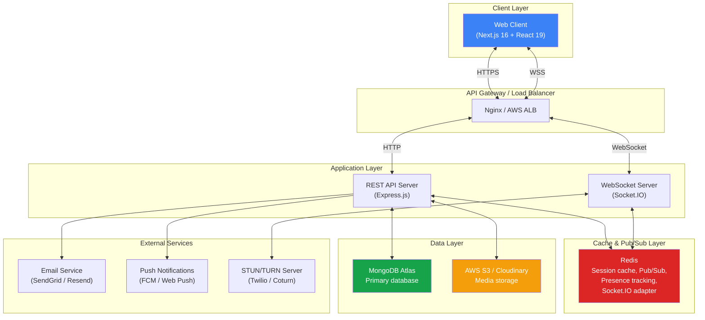

### Architecture Principles

| Principle | Implementation |
|-----------|---------------|
| **Monorepo** | Turborepo — shared types, configs, UI library between frontend and backend |
| **Modular Monolith** | Start as a monolith with clear module boundaries; microservice-ready via layered architecture |
| **Real-Time First** | Socket.IO for all live interactions; REST for CRUD and auth |
| **Offline-Tolerant** | Zustand persistence + message queue for offline message composition |
| **Horizontally Scalable** | Redis adapter for Socket.IO, stateless JWT auth, no server-side sessions |

---

## 3. Technology Stack Decisions

### Frontend

| Technology | Version | Why This? |
|-----------|---------|-----------|
| **Next.js (App Router)** | 16.x | SSR for auth pages (SEO, fast first paint), CSR for chat (interactive). Route groups for layout separation. |
| **React** | 19.x | Latest concurrent features, server components for non-interactive pages |
| **TypeScript** | 5.9+ | End-to-end type safety, shared types with backend |
| **Zustand** | 5.x | Lightweight (1.1KB), no boilerplate, built-in persistence middleware. Perfect for chat state that needs localStorage durability |
| **TanStack React Query** | 5.x | Server-state caching for REST endpoints (user profiles, call history, search results). Auto-refetch, pagination, optimistic updates |
| **Socket.IO Client** | 4.x | Auto-reconnection, fallback transports, room-based events. Pairs with server-side Socket.IO |
| **Axios** | 1.x | Request/response interceptors for auth token injection, 401 auto-logout, request cancellation |
| **React Hook Form + Zod** | 7.x / 3.x | Performant uncontrolled forms + schema-based validation shared with backend |
| **Framer Motion** | 11.x | Declarative animations for message transitions, page transitions, micro-interactions |
| **TailwindCSS** | 3.x | Rapid UI development, consistent design system, dark mode support |
| **next-themes** | 0.4.x | System/dark/light theme with zero-flash hydration |
| **dayjs** | 1.x | Lightweight date formatting (message timestamps, "last seen", relative time) |
| **Sonner** | 1.x | Toast notifications for connection status, errors, incoming call alerts |

### Backend

| Technology | Version | Why This? |
|-----------|---------|-----------|
| **Express.js** | 4.x | Mature, minimal, massive middleware ecosystem. Best for REST + Socket.IO hybrid |
| **Socket.IO** | 4.x | Reliable WebSocket abstraction with rooms, namespaces, auto-reconnection, binary support |
| **MongoDB + Mongoose** | 8.x | Document model naturally fits conversations/messages. Flexible schema for different message types. Atlas Search for full-text search |
| **Redis** | 7.x (via ioredis) | In-memory cache for presence/typing state, pub/sub for multi-instance Socket.IO, rate limit counters |
| **JSON Web Tokens** | 9.x | Stateless auth — no session store needed. Short-lived access + long-lived refresh token pattern |
| **Multer + AWS S3** | — | Multi-part file uploads to S3 via streams. Multer handles parsing, S3 handles storage |
| **Sharp** | — | Server-side image processing — thumbnail generation, compression, format conversion |
| **Zod** | 3.x | Request validation shared with frontend. Same schemas validate forms AND API inputs |
| **Pino** | 9.x | 5x faster than Winston. Structured JSON logs for production (ELK/Datadog compatible) |
| **Helmet + CORS + rate-limit** | — | Security headers, origin whitelist, request throttling |
| **Nodemailer / Resend** | — | Transactional emails (password reset, verification) |
| **bcryptjs** | — | Password hashing with salt rounds |

### Infrastructure

| Technology | Purpose |
|-----------|---------|
| **MongoDB Atlas** | Managed database with auto-scaling, backups, Atlas Search |
| **Redis Cloud / ElastiCache** | Managed Redis for caching, pub/sub |
| **AWS S3 / Cloudinary** | Media file storage with CDN delivery |
| **Cloudflare / CloudFront** | CDN for static assets and media files |
| **Docker + Docker Compose** | Containerized local dev and production deployment |
| **GitHub Actions** | CI/CD pipeline (lint → test → build → deploy) |
| **Vercel** | Frontend deployment (Next.js optimized) |
| **Railway / Render / AWS ECS** | Backend deployment (Express + Socket.IO) |
| **Sentry** | Error tracking and performance monitoring |
| **Prometheus + Grafana** | Metrics, dashboards, alerting |

---

## 4. Database Design (MongoDB)

### Schema Architecture

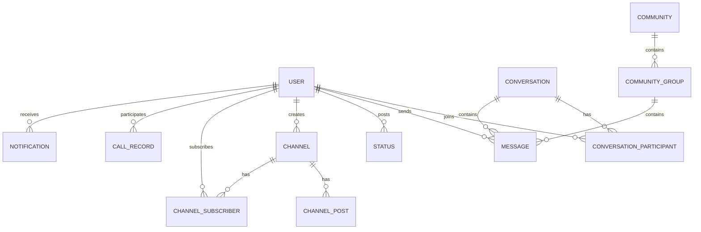

### Collection Schemas

#### Users Collection

```typescript
// models/User.ts
const UserSchema = new Schema({
  username: { type: String, required: true, unique: true, trim: true, minlength: 3, maxlength: 20 },
  email:    { type: String, required: true, unique: true, lowercase: true },
  password: { type: String, required: true, select: false }, // bcrypt hash, excluded from queries by default
  
  // Profile
  displayName: { type: String, maxlength: 50 },
  avatar:      { type: String }, // S3/Cloudinary URL
  about:       { type: String, default: "Hey there! I am using Let's Chat.", maxlength: 200 },
  
  // Presence
  isOnline:  { type: Boolean, default: false },
  lastSeen:  { type: Date },
  socketIds: [{ type: String }], // Multiple device connections
  
  // Settings
  pushToken:    { type: String },
  soundEnabled: { type: Boolean, default: true },
  
  // Account
  isVerified:        { type: Boolean, default: false },
  verificationToken: { type: String, select: false },
  resetToken:        { type: String, select: false },
  resetTokenExpiry:  { type: Date, select: false },
  refreshTokens:     [{ token: String, expiresAt: Date, device: String }], // select: false
}, { timestamps: true });

// Indexes
UserSchema.index({ email: 1 });
UserSchema.index({ username: 1 });
UserSchema.index({ isOnline: 1 });
```

#### Conversations Collection

```typescript
// models/Conversation.ts
const ConversationSchema = new Schema({
  type: { type: String, enum: ['direct', 'group'], required: true },
  
  // Group-specific fields
  name:        { type: String }, // null for direct chats
  avatar:      { type: String },
  description: { type: String, maxlength: 500 },
  createdBy:   { type: Schema.Types.ObjectId, ref: 'User' },
  
  // Participants (embedded for fast reads)
  participants: [{
    userId:   { type: Schema.Types.ObjectId, ref: 'User', required: true },
    role:     { type: String, enum: ['admin', 'member'], default: 'member' },
    joinedAt: { type: Date, default: Date.now },
    mutedUntil: { type: Date },
    isArchived: { type: Boolean, default: false },
  }],
  
  // Denormalized for fast list rendering
  lastMessage: {
    content:   String,
    senderId:  Schema.Types.ObjectId,
    timestamp: Date,
    type:      { type: String, enum: ['text', 'image', 'audio', 'document', 'system'] },
  },
  
  // Metadata
  pinnedMessages: [{ type: Schema.Types.ObjectId, ref: 'Message' }],
  isActive: { type: Boolean, default: true },
}, { timestamps: true });

// Indexes
ConversationSchema.index({ 'participants.userId': 1, updatedAt: -1 }); // User's chat list, sorted by recent
ConversationSchema.index({ type: 1, 'participants.userId': 1 });        // Filter by type
```

#### Messages Collection

```typescript
// models/Message.ts
const MessageSchema = new Schema({
  conversationId: { type: Schema.Types.ObjectId, ref: 'Conversation', required: true, index: true },
  senderId:       { type: Schema.Types.ObjectId, ref: 'User', required: true },
  
  // Content
  type:    { type: String, enum: ['text', 'image', 'audio', 'video', 'document', 'system', 'call'], required: true },
  content: { type: String }, // Text content or system message
  
  // Media attachments
  attachments: [{
    url:       String,       // S3/Cloudinary URL
    thumbnail: String,       // Pre-generated thumbnail URL
    filename:  String,
    mimeType:  String,
    size:      Number,       // Bytes
    duration:  Number,       // Seconds (for audio/video)
    width:     Number,       // Pixels (for images/video)
    height:    Number,
  }],
  
  // Reply reference
  replyTo: { type: Schema.Types.ObjectId, ref: 'Message' },
  
  // Reactions
  reactions: [{
    emoji:   String,
    userIds: [{ type: Schema.Types.ObjectId, ref: 'User' }],
  }],
  
  // Delivery tracking
  deliveredTo: [{ userId: Schema.Types.ObjectId, at: Date }],
  readBy:      [{ userId: Schema.Types.ObjectId, at: Date }],
  
  // Metadata
  isEdited:  { type: Boolean, default: false },
  isDeleted: { type: Boolean, default: false }, // Soft delete — "This message was deleted"
  deletedAt: { type: Date },
}, { timestamps: true });

// Indexes — critical for performance
MessageSchema.index({ conversationId: 1, createdAt: -1 }); // Message feed (paginated, newest first)
MessageSchema.index({ conversationId: 1, createdAt: 1 });   // Scroll-to-oldest
MessageSchema.index({ senderId: 1, createdAt: -1 });        // User's sent messages
MessageSchema.index({ content: 'text' });                    // Full-text search (or use Atlas Search)
```

#### Status Collection

```typescript
// models/Status.ts
const StatusSchema = new Schema({
  userId: { type: Schema.Types.ObjectId, ref: 'User', required: true },
  
  stories: [{
    type:            { type: String, enum: ['text', 'image'], required: true },
    content:         String,       // Text content or image URL
    backgroundColor: String,
    fontFamily:      String,
    caption:         String,
    viewedBy:        [{ userId: Schema.Types.ObjectId, at: Date }],
    createdAt:       { type: Date, default: Date.now },
    expiresAt:       { type: Date, required: true }, // createdAt + 24 hours
  }],
}, { timestamps: true });

// TTL index — MongoDB automatically deletes expired stories
StatusSchema.index({ 'stories.expiresAt': 1 }, { expireAfterSeconds: 0 });
StatusSchema.index({ userId: 1 });
```

#### Channels Collection

```typescript
// models/Channel.ts
const ChannelSchema = new Schema({
  name:        { type: String, required: true },
  avatar:      String,
  description: { type: String, maxlength: 500 },
  ownerId:     { type: Schema.Types.ObjectId, ref: 'User', required: true },
  
  subscribers:    [{ type: Schema.Types.ObjectId, ref: 'User' }],
  subscriberCount: { type: Number, default: 0 },
  
  posts: [{
    content:   String,
    image:     String,
    reactions: [{ emoji: String, count: Number, userIds: [Schema.Types.ObjectId] }],
    createdAt: { type: Date, default: Date.now },
  }],
}, { timestamps: true });
```

#### Call Records Collection

```typescript
// models/CallRecord.ts
const CallRecordSchema = new Schema({
  callerId:   { type: Schema.Types.ObjectId, ref: 'User', required: true },
  receiverId: { type: Schema.Types.ObjectId, ref: 'User', required: true },
  type:       { type: String, enum: ['audio', 'video'], required: true },
  status:     { type: String, enum: ['missed', 'answered', 'rejected', 'busy'], required: true },
  startedAt:  Date,
  endedAt:    Date,
  duration:   Number, // seconds
}, { timestamps: true });

CallRecordSchema.index({ callerId: 1, createdAt: -1 });
CallRecordSchema.index({ receiverId: 1, createdAt: -1 });
```

### Indexing Strategy Summary

| Collection | Index | Purpose |
|-----------|-------|---------|
| `users` | `{ email: 1 }`, `{ username: 1 }` | Auth lookup, unique constraints |
| `conversations` | `{ 'participants.userId': 1, updatedAt: -1 }` | Chat list sorted by recent activity |
| `messages` | `{ conversationId: 1, createdAt: -1 }` | Paginated message feed (most critical query) |
| `messages` | `{ content: 'text' }` | Full-text search |
| `statuses` | `{ 'stories.expiresAt': 1 }` (TTL) | Auto-cleanup of expired stories |
| `callRecords` | `{ callerId: 1 }`, `{ receiverId: 1 }` | Call history lookup |

---

## 5. Backend Architecture — Detailed Design

### 5.1 Layered Architecture

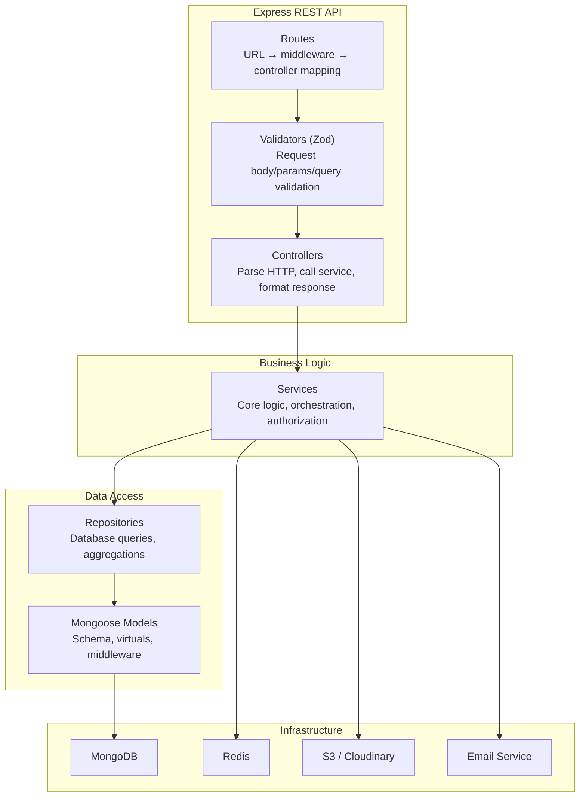

**Data flow for a typical request:**

```
POST /api/messages
  → rateLimiter middleware
  → authenticateJWT middleware
  → validateBody(sendMessageSchema) 
  → messageController.sendMessage(req, res)
    → messageService.sendMessage(senderId, conversationId, content, attachments)
      → conversationRepo.findById(conversationId) // verify membership
      → messageRepo.create({ conversationId, senderId, content, type, attachments })
      → conversationRepo.updateLastMessage(conversationId, message)
      → socketService.emitToRoom(conversationId, 'new_message', message) // real-time push
      → notificationService.sendPush(offlineParticipants, message) // push to offline users
    ← { message }
  ← res.status(201).json({ data: message })
```

### 5.2 Complete REST API Design

#### Authentication

| Method | Endpoint | Auth | Request Body | Description |
|--------|----------|------|-------------|-------------|
| `POST` | `/api/auth/register` | ❌ | `{ username, email, password }` | Create account, send verification email |
| `POST` | `/api/auth/login` | ❌ | `{ email, password }` | Returns access token + sets refresh token cookie |
| `POST` | `/api/auth/refresh` | Cookie | — | Exchange refresh token for new access token |
| `POST` | `/api/auth/logout` | ✅ | — | Invalidate refresh token, clear cookie |
| `POST` | `/api/auth/forgot-password` | ❌ | `{ email }` | Send password reset email |
| `POST` | `/api/auth/reset-password` | ❌ | `{ token, newPassword }` | Reset password with token |
| `GET` | `/api/auth/verify/:token` | ❌ | — | Verify email address |

#### Users

| Method | Endpoint | Auth | Description |
|--------|----------|------|-------------|
| `GET` | `/api/users/me` | ✅ | Get authenticated user's profile |
| `PATCH` | `/api/users/me` | ✅ | Update profile (displayName, about, avatar) |
| `GET` | `/api/users/search?q=` | ✅ | Search users by username/email |
| `GET` | `/api/users/:id` | ✅ | Get another user's public profile |

#### Conversations

| Method | Endpoint | Auth | Description |
|--------|----------|------|-------------|
| `GET` | `/api/conversations` | ✅ | List user's conversations (paginated, sorted by lastMessage.timestamp) |
| `POST` | `/api/conversations` | ✅ | Create direct or group conversation |
| `GET` | `/api/conversations/:id` | ✅ | Get conversation details + participants |
| `PATCH` | `/api/conversations/:id` | ✅ | Update group name/avatar/description (admin only) |
| `POST` | `/api/conversations/:id/participants` | ✅ | Add members to group |
| `DELETE` | `/api/conversations/:id/participants/:userId` | ✅ | Remove member / leave group |
| `PATCH` | `/api/conversations/:id/archive` | ✅ | Toggle archive for current user |
| `PATCH` | `/api/conversations/:id/mute` | ✅ | Mute/unmute conversation |

#### Messages

| Method | Endpoint | Auth | Description |
|--------|----------|------|-------------|
| `GET` | `/api/conversations/:id/messages` | ✅ | Get messages (cursor-based pagination) |
| `POST` | `/api/conversations/:id/messages` | ✅ | Send a message (text, or with attachments via multipart) |
| `PATCH` | `/api/messages/:id` | ✅ | Edit message content (sender only) |
| `DELETE` | `/api/messages/:id` | ✅ | Soft-delete message (sender only) |
| `POST` | `/api/messages/:id/reactions` | ✅ | Add/toggle emoji reaction |
| `POST` | `/api/conversations/:id/messages/:msgId/pin` | ✅ | Pin/unpin a message |

#### Status / Stories

| Method | Endpoint | Auth | Description |
|--------|----------|------|-------------|
| `GET` | `/api/statuses` | ✅ | Get all contacts' active statuses |
| `POST` | `/api/statuses` | ✅ | Publish a new status story |
| `DELETE` | `/api/statuses/:storyId` | ✅ | Delete own story |
| `POST` | `/api/statuses/:storyId/view` | ✅ | Mark a story as viewed |

#### Media Upload

| Method | Endpoint | Auth | Description |
|--------|----------|------|-------------|
| `POST` | `/api/upload` | ✅ | Upload file (multipart/form-data) → returns S3 URL |
| `POST` | `/api/upload/avatar` | ✅ | Upload + process avatar (resize, crop) |

#### Calls

| Method | Endpoint | Auth | Description |
|--------|----------|------|-------------|
| `GET` | `/api/calls` | ✅ | Get call history (paginated) |
| `POST` | `/api/calls` | ✅ | Log a completed call record |

### 5.3 Authentication Flow — JWT + Refresh Token

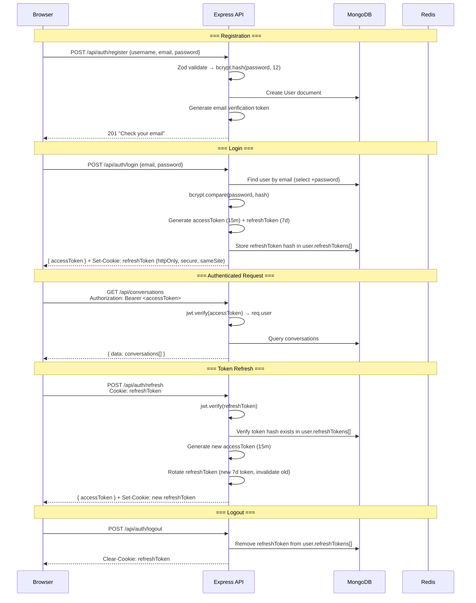

> [!IMPORTANT]
> **Why this pattern?**
> - **Access token (15min, in memory)**: Short-lived, stored only in JavaScript memory (not localStorage). Limits damage if leaked via XSS.
> - **Refresh token (7 days, HTTP-only cookie)**: Cannot be accessed by JavaScript. Automatically sent with requests. Rotation on every refresh prevents replay attacks.
> - **Token family tracking**: Store refresh tokens in an array. If a stolen token is used after rotation, detect reuse → invalidate ALL tokens for that user (force re-login).

### 5.4 File Upload Pipeline

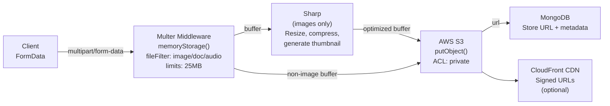

**Upload configuration:**

| File Type | Max Size | Processing |
|-----------|----------|-----------|
| Images (jpg, png, webp, gif) | 10 MB | Resize to max 1920px, compress to 80% quality, generate 200px thumbnail |
| Videos (mp4, webm) | 25 MB | Store as-is, generate poster frame |
| Audio (mp3, ogg, wav) | 10 MB | Store as-is |
| Documents (pdf, doc, xlsx, etc.) | 25 MB | Store as-is |

---

## 6. Real-Time Architecture (Socket.IO)

### 6.1 Connection Lifecycle

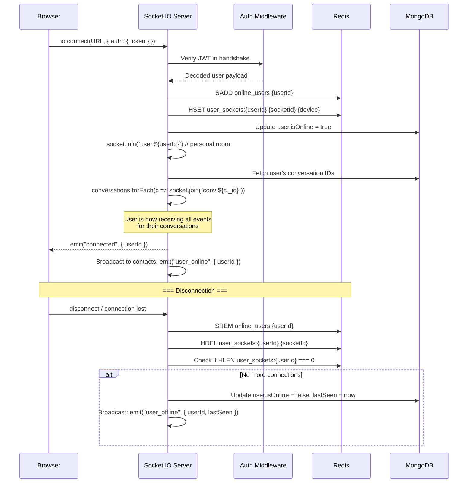

### 6.2 Socket.IO Authentication Middleware

```typescript
// sockets/auth-middleware.ts
io.use(async (socket, next) => {
  const token = socket.handshake.auth?.token;
  if (!token) return next(new Error('Authentication required'));
  
  try {
    const payload = jwt.verify(token, env.JWT_SECRET) as UserPayload;
    const user = await User.findById(payload.id).select('username avatar');
    if (!user) return next(new Error('User not found'));
    
    socket.data.user = { id: user._id, username: user.username, avatar: user.avatar };
    next();
  } catch (err) {
    next(new Error('Invalid token'));
  }
});
```

### 6.3 Complete Event Map

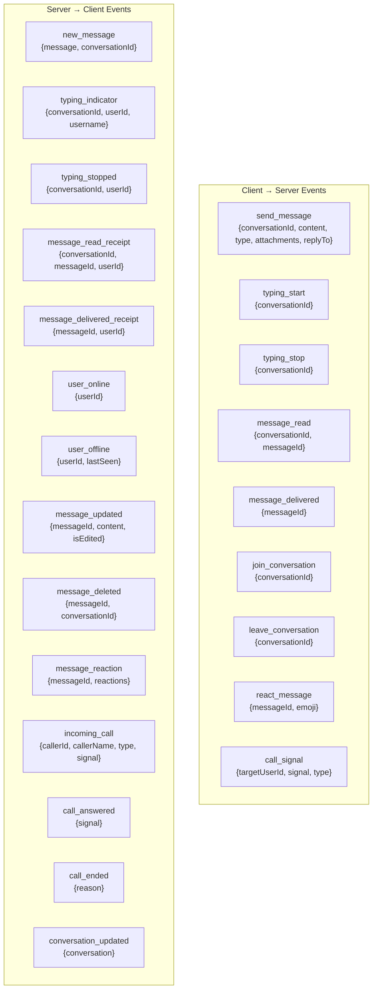

### 6.4 Message Delivery Flow

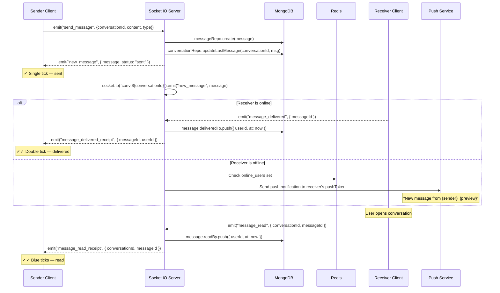

### 6.5 Typing Indicator Flow

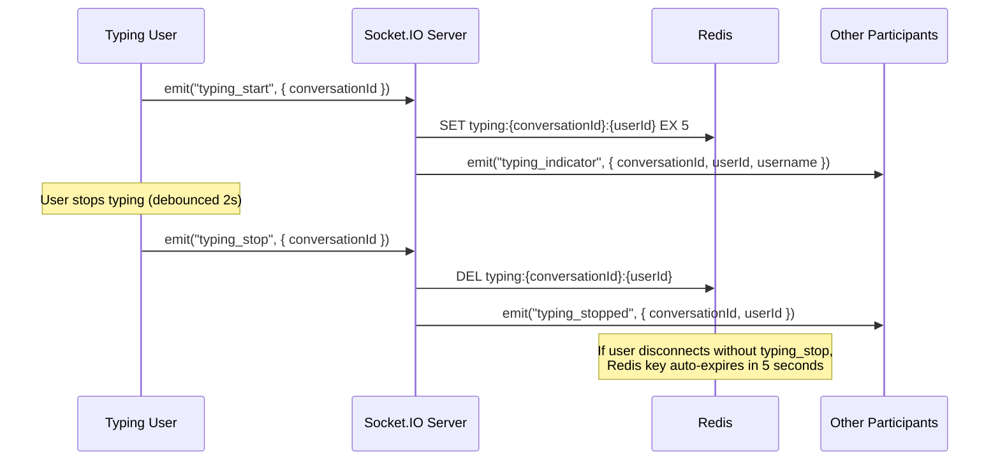

### 6.6 Presence System

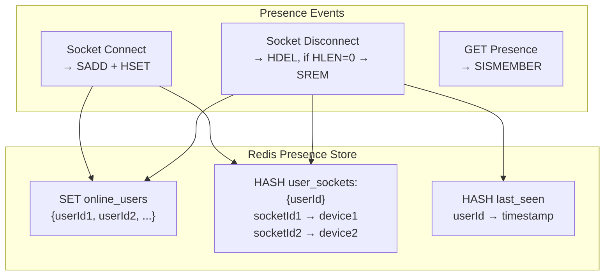

**Key design decisions:**
- **Multi-device support**: A user can be connected from multiple tabs/devices. They are "online" as long as at least one socket is connected.
- **Redis-backed**: Presence state lives in Redis (not MongoDB) for sub-millisecond reads.
- **Lazy expiry**: If a socket disconnects ungracefully, Redis TTL cleans up stale entries.

---

## 7. Frontend Architecture — Detailed Design

### 7.1 State Management Strategy

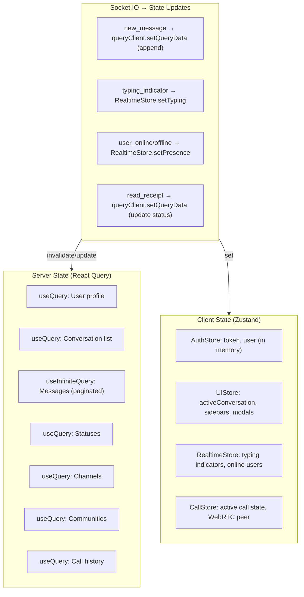

> [!TIP]
> **Why split state this way?**
> - **React Query** manages all data that comes from the server (conversations, messages, profiles). It handles caching, background refetching, pagination, and optimistic updates automatically.
> - **Zustand** manages purely client-side state (which conversation is open, UI toggles, active call) and real-time transient state (typing indicators, presence) that doesn't need server-cache semantics.
> - **Socket events** bridge the gap — they update React Query's cache directly (no re-fetch needed for new messages) and set Zustand state for transient indicators.

### 7.2 Message Loading — Infinite Scroll with Cursor Pagination

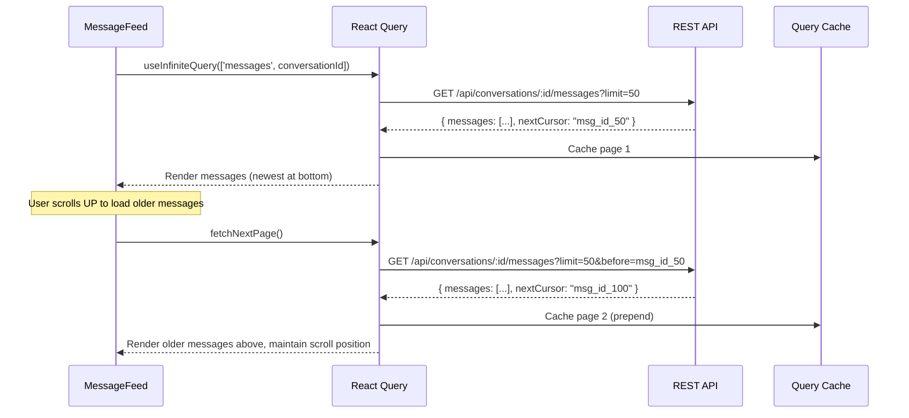

### 7.3 Optimistic Updates — Send Message Flow

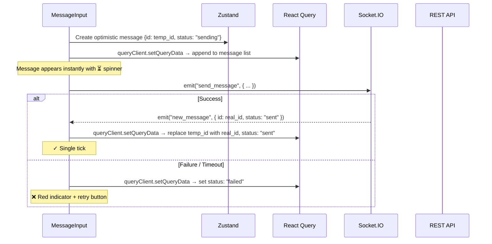

### 7.4 Frontend File Structure (Production)

```
apps/web/src/
├── app/                          # Next.js App Router
│   ├── layout.tsx                # Root providers (Theme, Query, Socket, Toast)
│   ├── page.tsx                  # Splash → redirect
│   ├── (auth)/                   # Auth route group (no sidebar)
│   │   ├── sign-in/page.tsx
│   │   ├── sign-up/page.tsx
│   │   ├── forgot-password/page.tsx
│   │   └── reset-password/page.tsx
│   └── (main)/                   # Protected route group (with sidebar)
│       ├── layout.tsx            # Sidebar + call overlay
│       ├── chat/page.tsx
│       ├── status/page.tsx
│       ├── channels/page.tsx
│       ├── communities/page.tsx
│       └── calls/page.tsx
│
├── components/                   # UI Components (grouped by feature)
│   ├── ui/                       # Design system primitives
│   │   ├── Button.tsx
│   │   ├── Input.tsx
│   │   ├── Modal.tsx
│   │   ├── Avatar.tsx
│   │   ├── Badge.tsx
│   │   ├── Skeleton.tsx          # Loading skeletons
│   │   └── ...
│   ├── auth/                     # Auth forms
│   ├── sidebar/                  # Navigation
│   ├── chat-list/                # Conversation list
│   ├── chat-window/              # Message feed + input
│   │   ├── ChatWindow.tsx
│   │   ├── ChatHeader.tsx
│   │   ├── MessageFeed.tsx       # Infinite scroll container
│   │   ├── MessageBubble.tsx     # Individual message rendering
│   │   ├── MessageInput.tsx      # Text + attachments + voice
│   │   ├── TypingIndicator.tsx   # "User is typing..."
│   │   └── ReplyPreview.tsx      # Reply-to preview bar
│   ├── details-panel/            # Contact/group info
│   ├── status/                   # Stories
│   ├── channels/
│   ├── communities/
│   └── calls/
│
├── hooks/                        # Custom hooks
│   ├── api/                      # React Query hooks
│   │   ├── use-conversations.ts  # useConversations(), useConversation(id)
│   │   ├── use-messages.ts       # useMessages(convId), useSendMessage()
│   │   ├── use-user.ts           # useCurrentUser(), useUpdateProfile()
│   │   ├── use-auth.ts           # useLogin(), useRegister(), useLogout()
│   │   ├── use-statuses.ts       # useStatuses(), usePublishStatus()
│   │   └── use-calls.ts          # useCallHistory()
│   ├── socket/                   # Socket event hooks
│   │   ├── use-socket.ts         # Connection context
│   │   ├── use-socket-messages.ts # Listen for new_message, update cache
│   │   ├── use-typing.ts         # Emit/listen typing events
│   │   └── use-presence.ts       # Online/offline tracking
│   └── ui/                       # UI behavior hooks
│       ├── use-chat-window.ts
│       ├── use-infinite-scroll.ts
│       └── use-media-upload.ts
│
├── store/                        # Zustand stores (client-only state)
│   ├── auth-store.ts             # Access token (in memory, NOT localStorage)
│   ├── ui-store.ts               # Active views, drawers, modals
│   ├── realtime-store.ts         # Typing indicators, online users map
│   └── call-store.ts             # WebRTC peer, call state
│
├── services/                     # API service layer
│   ├── auth-service.ts
│   ├── conversation-service.ts
│   ├── message-service.ts
│   ├── user-service.ts
│   ├── upload-service.ts
│   └── status-service.ts
│
├── lib/                          # Core utilities
│   ├── axios.ts                  # Axios instance + interceptors
│   ├── socket.ts                 # Socket.IO client instance
│   └── query-client.ts           # React Query client config
│
├── providers/                    # React Context providers
│   ├── auth-provider.tsx         # Auth state + token refresh timer
│   ├── socket-provider.tsx       # Socket.IO lifecycle
│   ├── theme-provider.tsx
│   ├── query-provider.tsx
│   └── toast-provider.tsx
│
├── types/                        # Shared TypeScript types
│   ├── user.ts
│   ├── conversation.ts
│   ├── message.ts
│   ├── status.ts
│   ├── channel.ts
│   ├── community.ts
│   ├── call.ts
│   └── socket-events.ts          # Typed socket event map
│
├── validation/                   # Zod schemas (shared with backend)
│   ├── auth.schema.ts
│   ├── message.schema.ts
│   ├── user.schema.ts
│   └── conversation.schema.ts
│
└── utils/                        # Helpers
    ├── format-date.ts            # "2 min ago", "Yesterday", etc.
    ├── file-helpers.ts           # File type detection, size formatting
    ├── crypto.ts                 # E2E encryption helpers (future)
    └── constants.ts              # App-wide constants
```

---

## 8. Voice & Video Calls — WebRTC Architecture

### 8.1 Infrastructure

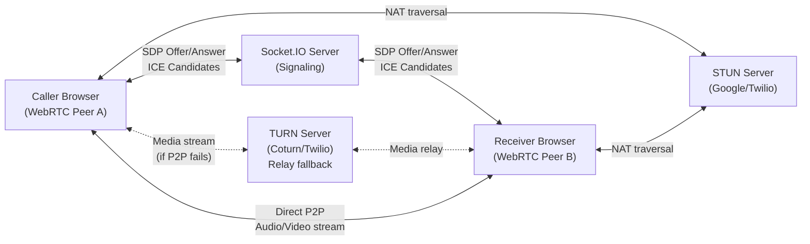

### 8.2 Call Signaling Flow

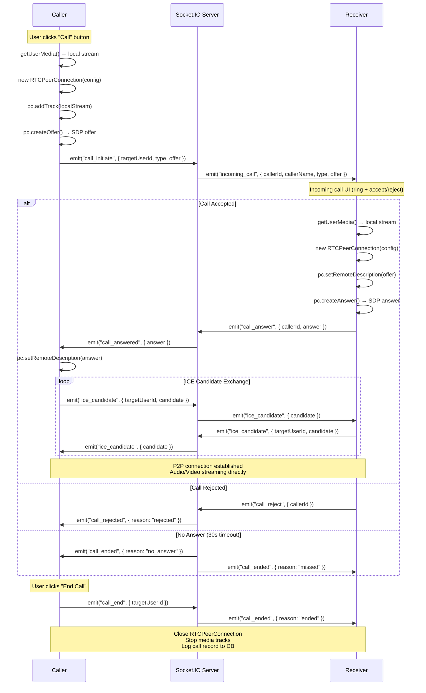

### 8.3 WebRTC Configuration

```typescript
const rtcConfig: RTCConfiguration = {
  iceServers: [
    { urls: 'stun:stun.l.google.com:19302' },          // Free Google STUN
    { urls: 'stun:stun1.l.google.com:19302' },
    {
      urls: 'turn:your-turn-server.com:3478',           // Self-hosted or Twilio
      username: 'turnuser',
      credential: 'turnpassword',
    },
  ],
  iceCandidatePoolSize: 10,
};
```

---

## 9. Push Notifications

### Architecture

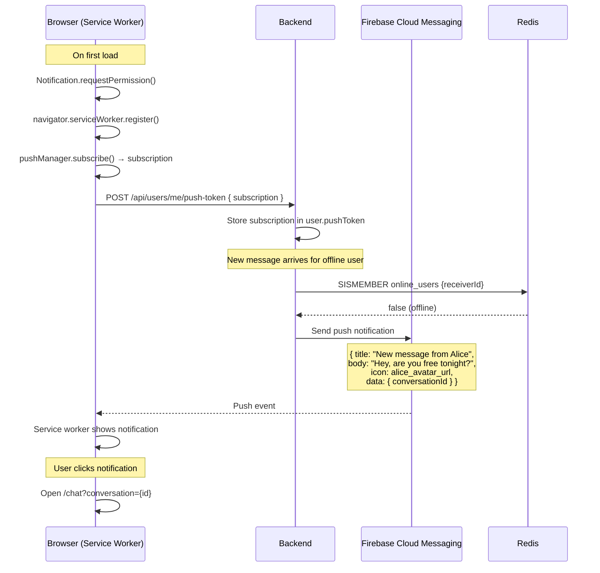

### When to Send Push Notifications

| Event | Push? | Condition |
|-------|-------|-----------|
| New message | ✅ | Receiver is offline OR conversation is not active |
| Incoming call | ✅ | Always (even if online — needs immediate attention) |
| Group mention (@user) | ✅ | User is offline |
| Status reply | ✅ | User is offline |
| New message (muted conv) | ❌ | Conversation is muted |

---

## 10. Search Architecture

### Full-Text Message Search

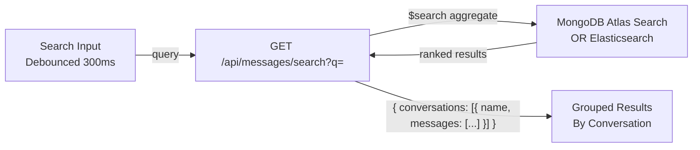

**MongoDB Atlas Search index:**

```json
{
  "mappings": {
    "dynamic": false,
    "fields": {
      "content": { "type": "string", "analyzer": "lucene.standard" },
      "conversationId": { "type": "objectId" },
      "senderId": { "type": "objectId" },
      "createdAt": { "type": "date" }
    }
  }
}
```

**Search query (aggregation pipeline):**

```typescript
Message.aggregate([
  {
    $search: {
      text: { query: searchTerm, path: 'content', fuzzy: { maxEdits: 1 } }
    }
  },
  { $match: { conversationId: { $in: userConversationIds } } }, // Security: only search user's convos
  { $limit: 50 },
  { $sort: { score: { $meta: 'textScore' }, createdAt: -1 } },
  {
    $lookup: {
      from: 'conversations', localField: 'conversationId',
      foreignField: '_id', as: 'conversation'
    }
  }
]);
```

---

## 11. Security Architecture

### Defense-in-Depth Layers

```mermaid
graph TD
    subgraph Layer1["Layer 1: Transport"]
        TLS["TLS/HTTPS Everywhere"]
        HSTS["HSTS Headers"]
    end

    subgraph Layer2["Layer 2: Network"]
        CORS["CORS Whitelist"]
        CSP["Content Security Policy"]
        Helmet["Helmet.js Security Headers"]
    end

    subgraph Layer3["Layer 3: Rate Limiting"]
        Global["Global: 100 req/15min per IP"]
        Auth["Auth endpoints: 5 req/15min"]
        Upload["Upload: 10 req/min"]
        Socket["Socket: 30 messages/min"]
    end

    subgraph Layer4["Layer 4: Authentication"]
        JWT["JWT Access Tokens (15min)"]
        Refresh["Refresh Tokens (7d, HTTP-only cookie)"]
        Rotation["Token Rotation + Family Detection"]
    end

    subgraph Layer5["Layer 5: Authorization"]
        RBAC["Role-Based: admin/member per conversation"]
        Ownership["Resource ownership verification"]
        Membership["Conversation membership checks"]
    end

    subgraph Layer6["Layer 6: Input"]
        Zod["Zod Schema Validation"]
        Sanitize["HTML/XSS Sanitization (DOMPurify)"]
        FileType["File type validation (magic bytes)"]
        SizeLimit["Upload size limits"]
    end

    subgraph Layer7["Layer 7: Data"]
        Hash["bcrypt Password Hashing (12 rounds)"]
        Select["Mongoose select:false for sensitive fields"]
        SoftDel["Soft deletes (no data loss)"]
        Encrypt["E2E Encryption (future — Signal Protocol)"]
    end

    Layer1 --> Layer2 --> Layer3 --> Layer4 --> Layer5 --> Layer6 --> Layer7
```

### Rate Limiting Strategy

```typescript
// Different limits for different endpoints
const authLimiter = rateLimit({ windowMs: 15 * 60 * 1000, max: 5 });   // Auth: strict
const apiLimiter = rateLimit({ windowMs: 15 * 60 * 1000, max: 100 });  // General API
const uploadLimiter = rateLimit({ windowMs: 60 * 1000, max: 10 });     // Uploads per minute

// Socket.IO rate limiting (per event)
const socketLimiter = new Map<string, { count: number; resetAt: number }>();
function rateLimitSocket(socketId: string, maxPerMinute: number): boolean {
  const now = Date.now();
  const entry = socketLimiter.get(socketId) || { count: 0, resetAt: now + 60000 };
  if (now > entry.resetAt) { entry.count = 0; entry.resetAt = now + 60000; }
  entry.count++;
  socketLimiter.set(socketId, entry);
  return entry.count <= maxPerMinute;
}
```

---

## 12. DevOps & Deployment

### 12.1 Docker Setup

```yaml
# docker-compose.yml
version: '3.8'
services:
  web:
    build:
      context: .
      dockerfile: apps/web/Dockerfile
    ports: ["3000:3000"]
    environment:
      - NEXT_PUBLIC_API_URL=http://api:5000
    depends_on: [api]

  api:
    build:
      context: .
      dockerfile: apps/api/Dockerfile
    ports: ["5000:5000"]
    environment:
      - MONGO_URI=mongodb://mongo:27017/letschat
      - REDIS_URL=redis://redis:6379
      - JWT_SECRET=${JWT_SECRET}
      - CORS_ORIGIN=http://localhost:3000
    depends_on: [mongo, redis]

  mongo:
    image: mongo:7
    ports: ["27017:27017"]
    volumes:
      - mongo_data:/data/db

  redis:
    image: redis:7-alpine
    ports: ["6379:6379"]

volumes:
  mongo_data:
```

### 12.2 CI/CD Pipeline (GitHub Actions)

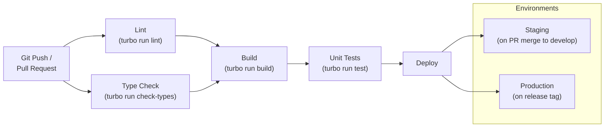

### 12.3 Environment Matrix

| Variable | Development | Staging | Production |
|----------|-------------|---------|-----------|
| `NODE_ENV` | `development` | `staging` | `production` |
| `MONGO_URI` | `localhost:27017` | Atlas cluster (staging) | Atlas cluster (prod) |
| `REDIS_URL` | `localhost:6379` | ElastiCache (staging) | ElastiCache (prod) |
| `JWT_SECRET` | dev secret | rotated secret | rotated secret (KMS) |
| `CORS_ORIGIN` | `http://localhost:3000` | `https://staging.letschat.com` | `https://letschat.com` |
| `S3_BUCKET` | local MinIO | staging bucket | prod bucket |
| `LOG_LEVEL` | `debug` | `info` | `warn` |

### 12.4 Monitoring Stack

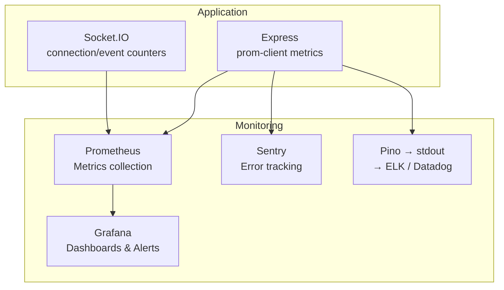

**Key metrics to track:**

| Metric | Type | Alert Threshold |
|--------|------|-----------------|
| `http_request_duration_seconds` | Histogram | P99 > 500ms |
| `ws_connections_active` | Gauge | > 10,000 per instance |
| `ws_messages_per_second` | Counter | > 5,000/s |
| `mongodb_query_duration_seconds` | Histogram | P95 > 200ms |
| `api_error_rate` | Counter | > 1% of requests |
| `auth_failed_attempts` | Counter | > 50/min (possible brute force) |

---

## 13. Scalability Architecture

### Horizontal Scaling with Redis Adapter

```mermaid
graph TB
    LB["Load Balancer<br/>(Sticky Sessions: WebSocket)"]
    
    subgraph Instance1["API Instance 1"]
        Express1["Express"]
        IO1["Socket.IO"]
    end
    
    subgraph Instance2["API Instance 2"]
        Express2["Express"]
        IO2["Socket.IO"]
    end
    
    subgraph Instance3["API Instance 3"]
        Express3["Express"]
        IO3["Socket.IO"]
    end

    Redis["Redis Pub/Sub<br/>(@socket.io/redis-adapter)"]
    MongoDB["MongoDB Atlas<br/>(Replica Set)"]

    LB --> Instance1
    LB --> Instance2
    LB --> Instance3

    IO1 <--> Redis
    IO2 <--> Redis
    IO3 <--> Redis

    Express1 --> MongoDB
    Express2 --> MongoDB
    Express3 --> MongoDB
```

**How it works:**
1. **Load balancer** distributes HTTP/WebSocket connections across instances (sticky sessions for WebSocket).
2. **Redis adapter** ensures that when Instance 1 emits to a room, the event is published to Redis and received by Instance 2 and 3, which forward it to their local sockets in that room.
3. **MongoDB Replica Set** handles read distribution across secondaries.

### Scaling Thresholds

| Component | Single Instance Limit | Scaling Strategy |
|-----------|----------------------|-----------------|
| **Socket.IO** | ~10,000 concurrent connections | Horizontal + Redis adapter |
| **Express API** | ~2,000 req/s | Horizontal behind load balancer |
| **MongoDB** | ~10,000 ops/s | Replica set → Sharding (by conversationId) |
| **Redis** | ~100,000 ops/s | Redis Cluster |
| **S3** | Practically unlimited | CDN caching |

### Message Collection Sharding Strategy

For very high scale (millions of users), shard the `messages` collection:

```typescript
// Shard key: { conversationId: 1, createdAt: 1 }
// This ensures all messages for a conversation land on the same shard
// Range queries (load chat history) are single-shard operations
```

---

## 14. Development Workflow

### Phase 1 — Foundation (Weeks 1-3)

```
✅ Monorepo setup (Turborepo, TypeScript, ESLint, Prettier)
✅ Frontend shell (Next.js App Router, TailwindCSS, theme)
✅ Backend skeleton (Express, middleware pipeline, Pino logger)
✅ Database connection (MongoDB Atlas, Mongoose)
✅ Auth system (register, login, JWT + refresh tokens, bcrypt)
✅ User profile CRUD
```

### Phase 2 — Core Messaging (Weeks 4-7)

```
□ Conversation model + CRUD API
□ Message model + send/receive API
□ Socket.IO integration (connect, rooms, send_message, new_message)
□ Frontend chat UI connected to real API (replace mock data)
□ Cursor-based message pagination (infinite scroll)
□ Typing indicators (Socket.IO + Redis)
□ Online presence system (Redis)
□ Read receipts (delivered + read)
□ File uploads (Multer → S3, images with Sharp processing)
```

### Phase 3 — Rich Features (Weeks 8-11)

```
□ Group chat (create, add/remove members, admin roles)
□ Message reactions (emoji)
□ Reply to message
□ Message edit + delete
□ Pin messages
□ Archive + mute conversations
□ Message search (Atlas Search)
□ Push notifications (Web Push API)
□ Status/Stories (create, view, auto-expire)
```

### Phase 4 — Advanced Features (Weeks 12-15)

```
□ Voice & video calls (WebRTC + signaling)
□ Channels (broadcast, follow/unfollow)
□ Communities (groups under community umbrella)
□ User search + contact discovery
□ Settings (notifications, privacy, account)
□ Performance optimization (virtualized lists, lazy loading)
```

### Phase 5 — Production Readiness (Weeks 16-18)

```
□ Docker containerization
□ CI/CD pipeline (GitHub Actions)
□ Error tracking (Sentry)
□ Monitoring (Prometheus + Grafana)
□ Load testing (Artillery / k6)
□ Security audit
□ Rate limiting tuning
□ Database index optimization
□ CDN setup for media assets
□ Documentation (API docs with Swagger/OpenAPI)
```

---

## 15. Quick Reference — How Everything Connects

```mermaid
graph TB
    User["👤 User opens Let's Chat"]
    
    User -->|1| Splash["Splash Screen<br/>Auto-redirect"]
    Splash -->|2| Auth["Auth Pages<br/>Register / Login"]
    Auth -->|3| JWT["JWT Issued<br/>Access (memory) + Refresh (cookie)"]
    JWT -->|4| Main["Main App Shell<br/>Sidebar + Page"]
    
    Main -->|5| Socket["Socket.IO Connect<br/>JWT in handshake"]
    Socket -->|6| Rooms["Auto-join all<br/>conversation rooms"]
    
    Main --> ChatList["Chat List<br/>React Query → GET /conversations"]
    ChatList -->|select| ChatWindow["Chat Window<br/>React Query → GET /messages (infinite)"]
    
    ChatWindow -->|type| Typing["Typing Indicator<br/>Socket emit → Redis → Room"]
    ChatWindow -->|send| Message["Send Message<br/>Optimistic UI → Socket emit → DB → Room broadcast"]
    ChatWindow -->|receive| Delivery["Delivery Status<br/>sent ✓ → delivered ✓✓ → read 🔵✓✓"]
    
    ChatWindow -->|attach| Upload["File Upload<br/>Multer → Sharp → S3 → URL in message"]
    ChatWindow -->|call| WebRTC["WebRTC Call<br/>Socket signaling → P2P stream"]
    
    Main --> Status["Status Stories<br/>POST → 24h TTL → Auto-delete"]
    Main --> Channels["Channels<br/>Follow/Unfollow + Reactions"]
    Main --> Communities["Communities<br/>Groups + Group messaging"]
    
    Message -->|offline user| Push["Push Notification<br/>Service Worker → FCM"]
```

> [!CAUTION]
> **This is a living document.** Update it as architectural decisions evolve during development. The schemas and APIs defined here are the **target design** — implement incrementally following the phased development workflow in Section 14.
