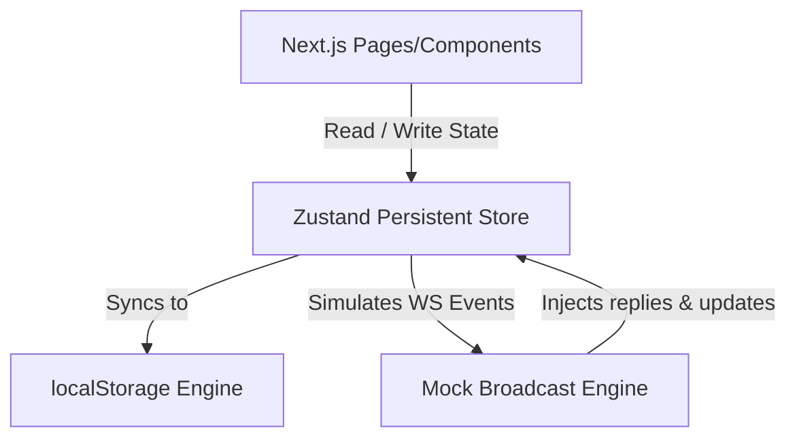

# Integration and Scalability Report: Frontend-to-Backend Transition

This report outlines the technical blueprint to complete the **Let's Chat** frontend using a simulated backend environment, migrate to a fully functional MongoDB/Express/Socket.io server, and scale the infrastructure to comfortably support **5,000 to 50,000 users** with high concurrency.

---

## 1. Current State Assessment & Gaps

We reviewed the `apps/web` and `apps/api` source directories. The frontend has a polished layout structure but relies on transient local states and hardcoded static mocks:

### Identified Architectural Gaps:
1. **Transient Hook State (State Loss on Navigating)**:
   - Hooks like [useChannels](file:///d:/Personal%20Projects/letschat-web/apps/web/src/hooks/use-channels.ts), [useChatWindow](file:///d:/Personal%20Projects/letschat-web/apps/web/src/hooks/use-chat-window.ts), and [useCommunities](file:///d:/Personal%20Projects/letschat-web/apps/web/src/hooks/use-communities.ts) manage updates in local React `useState` variables. 
   - Because Next.js 16 uses component unmounting during page navigation (e.g., clicking between Chats, Status, Channels, and Communities in [Sidebar.tsx](file:///d:/Personal%20Projects/letschat-web/apps/web/src/components/sidebar/Sidebar.tsx)), **all chat history updates, new messages, and status views are completely lost** upon changing tabs.
2. **Disconnected Socket.IO Connection**:
   - The [socket-provider.tsx](file:///d:/Personal%20Projects/letschat-web/apps/web/src/providers/socket-provider.tsx) has its real connection blocks commented out. The application is running in "Static/Offline Demo Mode".
3. **Empty Backend Service Layer**:
   - The backend `apps/api` contains an Express skeleton, CORS middleware, rate limiters, and basic JWT route, but directories like `models/`, `routes/`, `controllers/`, and `repositories/` are empty.

---

## 2. Phase 1: Frontend Completion (Simulated Backend State)

Before connecting the real server, we can make the frontend complete and fully testable by replacing transient states with a **Centralized Simulated Backend Layer**.



### Step 1: Centralizing and Persisting Mock States
We will migrate all data-retrieval hooks to utilize global Zustand stores with **local storage persistence middleware**. This ensures that sent messages, read statuses, and followed channels persist across page refreshes and tab navigations.

```typescript
// Proposed structure for a persisted Zustand Chat Store
import { create } from "zustand";
import { persist, createJSONStorage } from "zustand/middleware";
import { mockRooms, initialOliviaMessages } from "@/constants/mock-data";
import { Message, ChatRoom } from "@/types/chat";

interface UnifiedChatState {
  rooms: ChatRoom[];
  messages: Record<string, Message[]>;
  activeRoomId: string | null;
  
  // Actions
  setActiveRoom: (roomId: string | null) => void;
  sendMessage: (roomId: string, content: string, attachment?: any) => void;
  markAsRead: (roomId: string) => void;
  receiveIncomingMessage: (roomId: string, message: Message) => void;
}

export const useUnifiedChatStore = create<UnifiedChatState>()(
  persist(
    (set, get) => ({
      rooms: mockRooms,
      messages: { olivia: initialOliviaMessages },
      activeRoomId: null,

      setActiveRoom: (roomId) => set({ activeRoomId: roomId }),

      sendMessage: (roomId, content, attachment) => {
        const newMsg: Message = {
          id: `msg-${Date.now()}`,
          senderId: "me",
          senderName: "John Doe",
          content,
          timestamp: new Date().toLocaleTimeString([], { hour: "2-digit", minute: "2-digit" }),
          status: "sent",
          attachment,
        };

        set((state) => ({
          messages: {
            ...state.messages,
            [roomId]: [...(state.messages[roomId] || []), newMsg],
          },
          rooms: state.rooms.map((r) =>
            r.id === roomId
              ? { ...r, lastMessage: content || (attachment?.name ?? "Attachment"), timestamp: "Just now" }
              : r
          ),
        }));
      },

      markAsRead: (roomId) => {
        set((state) => ({
          rooms: state.rooms.map((r) => (r.id === roomId ? { ...r, unreadCount: 0 } : r)),
        }));
      },

      receiveIncomingMessage: (roomId, message) => {
        set((state) => ({
          messages: {
            ...state.messages,
            [roomId]: [...(state.messages[roomId] || []), message],
          },
          rooms: state.rooms.map((r) =>
            r.id === roomId
              ? {
                  ...r,
                  lastMessage: message.content,
                  timestamp: message.timestamp,
                  unreadCount: state.activeRoomId === roomId ? 0 : (r.unreadCount || 0) + 1,
                }
              : r
          ),
        }));
      },
    }),
    {
      name: "letschat-persistent-storage",
      storage: createJSONStorage(() => localStorage),
    }
  )
);
```

### Step 2: The Mock Broadcast Engine (Activity Simulator)
To make the application feel active and test real-time components (like unread badges, status updates, and typing indicators), we can build an asynchronous simulator that schedules mock incoming messages and status updates:

- **Typing Simulation**: When the user sends a message, trigger a typing state for the recipient after 1s, followed by an automated smart reply after another 1s.
- **Background Events**: Use a `setInterval` hook in a root layout provider to randomly trigger:
  - Olivia or Lucas changing their status from online to offline.
  - New stories being uploaded to the Channels page.
  - Group chats receiving messages from other mock members.

---

## 3. Phase 2: Real Backend Integration

Once the client-side state is stable and central, we connect it to the `apps/api` service. Below is the blueprint of schemas, endpoints, and WebSocket events.

```
                  +--------------------------------+
                  |         Client (web)           |
                  +---------------+----------------+
                                  |
            REST APIs             |       WebSockets (Socket.io)
            (HTTP/HTTPS)          |       (Real-Time Events)
                                  v
                  +---------------+----------------+
                  |          API Gateway           |
                  +---------------+----------------+
                                  |
                                  v
                  +---------------+----------------+
                  |       Node.js/Express Server   |
                  +---------------+----------------+
                                  |
                                  v
                  +---------------+----------------+
                  |         MongoDB Atlas          |
                  +--------------------------------+
```

### 3.1 Database Schema Design (MongoDB/Mongoose)

To handle messaging dynamics, room structures, and user status efficiently:

#### User Schema
```typescript
import { Schema, model } from "mongoose";

const UserSchema = new Schema({
  username: { type: String, required: true, unique: true, index: true },
  email: { type: String, required: true, unique: true },
  passwordHash: { type: String, required: true },
  avatarUrl: { type: String, default: "" },
  about: { type: String, default: "Hey there! I am using Let's Chat." },
  soundEnabled: { type: Boolean, default: true },
  isOnline: { type: Boolean, default: false },
  lastSeen: { type: Date, default: Date.now },
}, { timestamps: true });
```

#### Room Schema (Handles Direct, Group, and Communities)
```typescript
const RoomSchema = new Schema({
  name: { type: String, required: false }, // Empty for DMs
  type: { type: String, enum: ["direct", "group", "community-channel"], default: "direct" },
  participants: [{ type: Schema.Types.ObjectId, ref: "User", index: true }],
  communityId: { type: Schema.Types.ObjectId, ref: "Community", required: false, index: true },
  avatarUrl: { type: String },
  createdBy: { type: Schema.Types.ObjectId, ref: "User" },
}, { timestamps: true });
```

#### Message Schema
```typescript
const MessageSchema = new Schema({
  roomId: { type: Schema.Types.ObjectId, ref: "Room", required: true, index: true },
  senderId: { type: Schema.Types.ObjectId, ref: "User", required: true },
  senderName: { type: String, required: true },
  content: { type: String, default: "" },
  attachment: {
    name: { type: String },
    size: { type: String },
    url: { type: String },
    type: { type: String, enum: ["image", "document", "audio", "video"] }
  },
  readBy: [{ type: Schema.Types.ObjectId, ref: "User" }], // Tracking read receipts
}, { timestamps: true });

// CRITICAL INDEX FOR HISTORICAL SCROLL SCALABILITY
MessageSchema.index({ roomId: 1, createdAt: -1 });
```

### 3.2 WebSocket Event Contract
The Socket.IO communication needs a precise contract to handle real-time sync without race conditions:

| Event Name | Direction | Payload Structure | Description |
|---|---|---|---|
| `subscribe` | Client -> Server | `{ roomIds: string[] }` | Join room rooms to receive broadcasts. |
| `message:send` | Client -> Server | `{ roomId: string, content: string, attachment?: any }` | Send a new message. |
| `message:receive`| Server -> Client | `{ id: string, roomId: string, senderId: string, content: string, createdAt: Date }` | Receive message in a room. |
| `typing:start` | Client -> Server | `{ roomId: string }` | Notify typing in a room. |
| `typing:state` | Server -> Client | `{ roomId: string, username: string, isTyping: boolean }` | Broadcast typing states. |
| `user:status` | Server -> Client | `{ userId: string, isOnline: boolean, lastSeen: Date }` | Broadcast presence changes. |

---

## 4. Phase 3: High-Scale Architecture (5,000 - 50,000 Users)

Scaling a chat application to **50,000 registered users** with an estimated **10% concurrency peak (5,000 simultaneous connections)** introduces specific challenges in real-time message distribution, memory, database operations, and browser rendering.

### 4.1 Capacity Planning
* **Concurrent Socket Connections**: Up to 5,000 connections.
* **Message Throughput**: Assuming 10% active users send 1 message per minute: 
  $$\text{Throughput} = \frac{500 \text{ messages}}{60 \text{ seconds}} \approx 8.3 \text{ messages/sec}$$
  Peak spikes could reach 50–100 messages/sec.
* **Bandwidth Usage**: Average text message is $\approx 1 \text{ KB}$. At 100 messages/sec, bandwidth is $\approx 100 \text{ KB/s}$ for incoming. Outgoing broadcast multiplies by the number of participants in a room. For a group of 50 users, 1 message results in $50 \text{ KB}$ outgoing.

---

### 4.2 Backend Scaling Strategies

#### Horizontal Socket.IO Scaling with Redis Adapter
A single Node.js process struggles to handle large volumes of concurrent WebSockets due to event loop single-threaded blocking. We must run multiple API server instances behind an Application Load Balancer (ALB) or Nginx with sticky sessions enabled.

To allow instances to talk to each other and broadcast messages to users on different servers, integrate the `@socket.io/redis-adapter`:

```
                 +-----------------------+
                 |    Load Balancer      |
                 +-----+-----------+-----+
                       |           |
        +--------------v---+   +---v--------------+
        |  API Server 1    |   |  API Server 2    |
        +--------+---------+   +--------+---------+
                 |                      |
                 +-----------+----------+
                             |
                             v
                 +-----------+----------+
                 |  Redis Pub/Sub Bus   |
                 +----------------------+
```

1. **Nginx Sticky Sessions Configuration**:
   WebSockets begin with an HTTP handshake, then upgrade. The load balancer must route subsequent requests from a client to the *same* instance during the upgrade phase.
2. **Redis Adapter Integration**:
   When Server 1 broadcasts a message to Room A, it writes it to Redis Pub/Sub. Server 2 reads this event from Redis and sends it to all its clients that are members of Room A.

#### Database Optimization & Query Performance
As the message collection exceeds millions of entries:
* **Cursor-Based Pagination**: Do **NOT** use `skip` and `limit` for loading chat history:
  ```typescript
  // Bad (degrades to O(N) as pages get deep):
  Message.find({ roomId }).sort({ createdAt: -1 }).skip(page * limit).limit(limit)
  
  // Good (O(log N) using Indexed attributes):
  Message.find({ roomId, _id: { $lt: lastLoadedMessageId } })
         .sort({ _id: -1 })
         .limit(limit)
  ```
* **Read Replicas**: Configure a MongoDB Atlas Replica Set (1 Primary for writes, 2 Secondaries for reads). Configure the API server to query the secondary nodes for historical message fetching to reduce load on the primary node.
* **Connection Pooling**: Tweak the mongoose connection options (`maxPoolSize: 100`) to reuse database connections, preventing TCP handshake overhead on every HTTP query.

#### Messaging Caching Layer
Use Redis to cache the **last 50 messages** of active rooms:
- When a user opens a chat, retrieve the last 50 messages from Redis (sub-millisecond retrieval).
- If they scroll past the initial 50 messages, retrieve older messages from MongoDB.
- This shields the database from massive queries when users navigate between chats.

---

### 4.3 Frontend Performance Optimizations

#### Virtual Scroll Lists for Message Feed
If a user is in a long-standing group chat with thousands of messages, rendering all of them in the DOM will crash the mobile/desktop browser.
* Use **`@tanstack/react-virtual`** inside `MessageFeed.tsx`. It dynamically mounts only the components currently visible in the user's viewport, swapping content in and out as the user scrolls.

#### Decoupled Global Stores and Selectors
Ensure components only re-render when their specific tracked states change:
```typescript
// Bad: Entire component re-renders on any state update
const state = useChatStore();

// Good: Only re-renders if activeRoomId changes
const activeRoomId = useChatStore((state) => state.activeRoomId);
```

#### Media Handling & CDNs
With thousands of users uploading images, voice notes, and attachments:
* Client uploads attachments directly to **Amazon S3 / Cloudflare R2** via signed URLs.
- The API server receives only the asset metadata (URL, file size, name), never routing heavy media files through Node.js.
- Deliver assets through a Global CDN (Cloudflare or CloudFront) to cache files near users, saving bandwidth and lowering response latency.

#### Reconnection Protocol & Offline Buffer
To handle mobile disconnects and network transitions:
- Implement **Exponential Backoff** reconnect logic on the client.
- Create an **Offline Buffer** in the Zustand store. If the client is disconnected, messages are queued locally with a "pending" status and sent automatically once the socket reconnects.

---

## 5. Summary of Recommended Roadmap

| Step | Action Item | Target Phase | Expected Impact |
|:---:|---|:---:|---|
| **1** | Build persisted Zustand stores to replace `useState` in channels, status, and chat feeds. | Simulated Phase | Solves layout navigation state loss immediately. |
| **2** | Add a background simulator to push mock reactions, statuses, and typings. | Simulated Phase | Enables testing UI features without running any backend setup. |
| **3** | Un-comment Socket.IO handshakes and integrate MongoDB database models. | Real Backend Phase | Moves from offline mock state to database-backed live client. |
| **4** | Setup index constraints on MongoDB and implement cursor pagination. | Scalability Phase | Prevents database query degradation as dataset scales. |
| **5** | Deploy Socket.IO cluster backend with PM2, Nginx, and Redis Pub/Sub. | Scalability Phase | Enables support for up to 50,000 concurrent sockets. |
